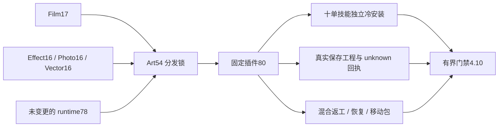

# ArtCraft 内层JSON分发架构

> 候选源54／插件80；复用不可变runtime78。固定安装门禁4.10待验收。更新：2026-10-07。

## 事实源与版本

本次依赖升级由 OpenSpec AC-RT-002 任务4.10持有。Film17 与 Effect／Photo／Vector16 技能源在绑定返回值或写成功回执前，拒绝工具text内层JSON中的非有限数值、溢出和重复键。完整Git ZIP摘要绑定全部48项领域完整命令入口。编排源码未变，runtime78制品保持字节一致；旧源53／插件79的分发锁和安装目录保持不可变。

## 恢复合同

完整命令保留 `craft-command-receipt/v1`：unknown步骤、journal／failure回执，以及原输出目录内真实保存的文件。公开创作工作流保留 `craft-failed-stage/v1`：相对路径指向原位置暂存。必须按schema选择恢复路径，两类都不是成功交付manifest。先确认停止证据，再在新只读会话打开原保存工程，保留原attempt；不得删除诊断后重放未知请求。

## 验收边界

核验精确固定宿主身份、58项安装摘要；从四个Art领域捆绑完整命令入口各执行九类原生保存后故障，重新打开原工程并验证健康局部返工。十项Art技能分别从空运行时安装。验证HD四领域混合创作、Logo消费者更新、独立节点复用、坏帧恢复与五子工程移动包。候选或旧版本证据不关闭4.10；逐命令、GUI、模型与完整V1仍单独开放。
