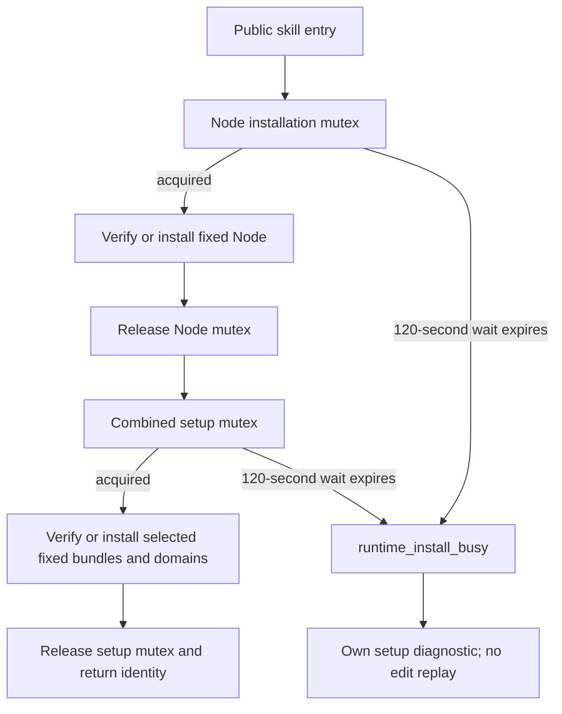

# ArtCraft bounded installation lock architecture

## 1. Problem and scope

The source candidate replaces unbounded blocking `flock` in the Node installer and combined setup with nonblocking acquisition and a monotonic deadline. Each lock has a 120-second production budget; this is not a 120-second deadline for an entire installation or workflow. OpenSpec authority is ArtCraft `AC-RT-002-ART-INSTALL-LOCK` in the plugin repository. The same bootstrap/setup resources are synchronized to all ten independent Art skills.

This is an unpublished candidate. Immutable source86/plugin114 and their prior acceptance remain unchanged. The four domain installers and native editing commands are unchanged. Publication and installed fixed-version acceptance remain outstanding.

## 2. Coordination and failure

Locks are acquired separately. An unsuccessful attempt sleeps for at most 50 milliseconds or the remaining budget. Timeout occurs before download, publication or native work under that lock and raises `TimeoutError`, which the public bootstrap reports through its existing dependency failure envelope. The installer does not decide ownership from a PID or a leftover lock file; the operating system releases flock when its owning process exits. Retry is an explicit new caller action. Existing runtime verification, source hashes, atomic publication and corruption refusal remain mandatory.

## 3. Validation boundaries

Real holder processes reproduce the baseline hang. Tests use shortened wait budgets to verify timeout, preservation of existing Node and user project files, kernel lock release after SIGKILL, reuse without an archive, waiting followed by success, and the public bootstrap's own setup diagnostic. The complete source suite runs 160 tests: 122 pass and 38 conditional tests skip. Resource synchronization also passes.

Candidate public first-use evidence is recorded separately for each copied skill, with an empty runtime, system-only PATH, public fixed Node/runtime downloads, both locks held by owned processes and owner termination. Exact Node and runtime identities plus unchanged skill hashes are checked. These version probes do not install or exercise domain creative workflows, do not substitute for actual generic Skills CLI installation, and do not close the full requirement or V1.

[Candidate evidence](evidence/art-install-lock-candidate-20261008.json): all ten skills pass, with 20 successful public version probes. Every copied skill still matches current source. Completed QA runtimes were inventoried and removed only after terminal calls and a fresh open-handle check; logs and skill copies remain. This evidence is bound to unpublished candidate bytes and must not be attributed to immutable source86/plugin114.
