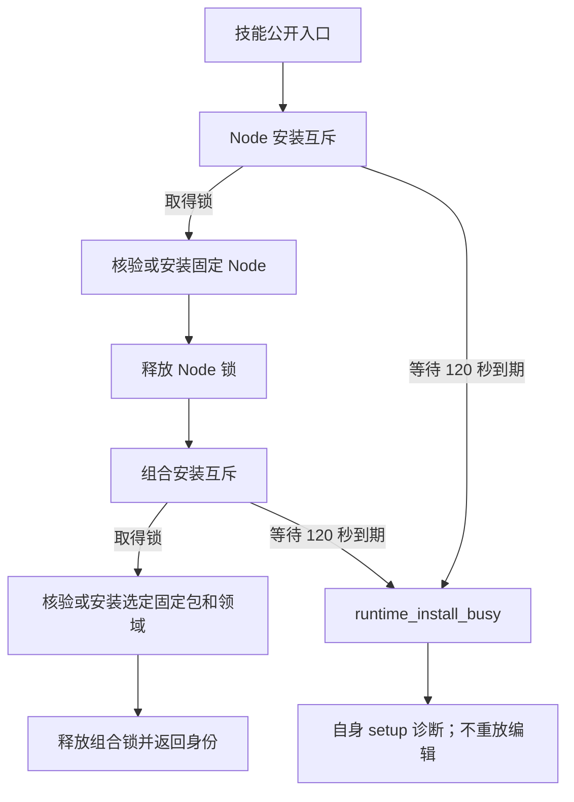

# ArtCraft 有界安装互斥架构

## 1. 问题与范围

本修复将 Node 安装器及组合安装器的无限阻塞 `flock` 改为非阻塞尝试和单调时钟截止时间。生产配置每把锁最多等待 120 秒；这不代表整个安装或工作流限时 120 秒。规范事实源是插件仓库的 ArtCraft `AC-RT-002-ART-INSTALL-LOCK`。相同 bootstrap／setup 资源同步到全部十个独立 Art 技能。

本修复已发布为不可变 source87／plugin115，公开 ZIP 与标签归档字节一致。实际 Codex 安装发现 64 技能、零加载错误；十个变化技能分别在独立空缓存完成公开冷安装，其余 54 项仅复用完整摘要相等的历史冷证明。四个领域安装器与原生编辑命令未改变；历史 source86／plugin114 保留原验收身份。

## 2. 协调与失败

两把锁分别取得。每次未取得锁后最多休眠 50 毫秒，剩余预算不足时仅休眠剩余时长。超时发生在该锁保护的下载、发布或原生操作之前，抛出 `TimeoutError`，由公开 bootstrap 通过既有依赖失败回执返回。不依赖 PID 或残留锁文件判断所有权；持锁进程退出后由操作系统释放 flock。重试是调用者的显式新调用。已有安装核验、来源摘要、原子发布及损坏拒绝仍须满足。

## 3. 验证边界

真实持锁进程复现基线挂起。测试缩短等待预算，验证超时、已有 Node／用户工程保全、SIGKILL 后内核释放锁、无归档缓存复用、等待后成功及公开 bootstrap 自身 setup 诊断。源码完整回归共 160 项：122 项通过、38 项条件跳过；资源同步校验通过。

候选公开首用证据按每个独立复制技能分别记录：空运行时、仅系统 PATH、固定公开 Node／运行时下载、两把锁分别由自有进程占用并终止持锁者。核对精确 Node／运行时身份及技能摘要保全。版本探测不安装或执行领域创作工作流，不代替真实通用 Skills CLI 安装，也不关闭完整要求或 V1。

[候选证据](evidence/art-install-lock-candidate-20261008.json)：十个技能全部通过，20 次公开版本探测成功。每个副本仍与当前技能源摘要一致。本轮 QA 运行时仅在调用结束、文件清单留存及新一次打开句柄检查后清理；日志和技能副本保留。该历史证据绑定发布前候选字节，不能归入 source86／plugin114；source87／plugin115 的安装验收另见下文。

固定发行安装后补证：[source87／plugin115 首用](evidence/craft-art115-install-lock-fixed-first-use-20261008.json)。安装副本单技能的公开冷安装、四领域原生创建／源返工／复用／移动包及回执拒绝通过，执行后 64 个安装整树摘要仍匹配。此前两次磁盘不足为失败，不以初次创建成功代替完整测试；清理已结束 QA 缓存、保留工程与日志后在新空目录重跑通过。仅证明上述技术场景，3.16、4.5／4.6完整合同及 V1 继续开放。
