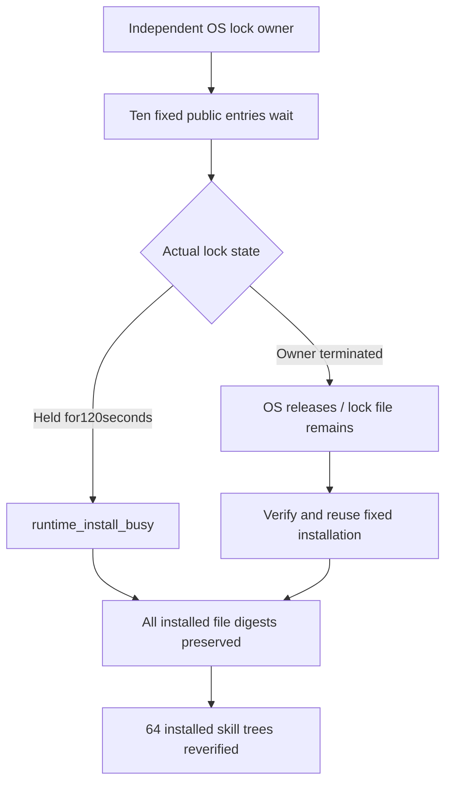

# ArtCraft Fixed Installation Mutex Acceptance Architecture

Current plugin130/source102/runtime129 now has fixed installed evidence for AC-RT-002-ART-INSTALL-LOCK. Task4.6 as a whole remains open.

The test invokes all10 host-installed public Python CLI entries without changing the production120-second timeout. A real independent process owns the OS lock in each phase: all10 calls wait approximately120seconds and return runtime_install_busy while the owner is still alive, preserving installed files. A new owner is then killed while10 calls are waiting; the OS releases ownership, each waiter verifies and reuses the fixed runtime129 installation, and the residual lock file remains. Node and combined-setup phases each exercise10 timeout calls and10 owner-exit reuse calls, totaling40 public calls.

Native editing and rendering are outside these call paths. Waiting preserves installed files and publishes no new installation. Actual empty-cache downloads and first use remain separate [fixed distribution evidence](ArtCraft-Runtime-Upgrade-Distribution-Architecture.md); the warm mutex test is not a new download test. Byte comparisons against source87 show unchanged Node installer, download module and Node lock, but a changed combined installer. The current public-entry test therefore verifies the changed combined installer rather than inheriting historical success.

[Fixed mutex evidence](evidence/fixed-mutex-acceptance130-20261009.json) records40-call statistics, runtime file count/digest,64-tree verification and test/raw evidence hashes. Raw arguments and outputs stay in isolated local QA artifacts. Actual Python is3.14.8. Explicit environment enables this test; ordinary CI skips the lengthy installed exercise and does not count that skip as a pass.

Only this row in the14-scenario audit becomes verified-current-installed. Domain CLI concurrency, missing native command schemas and other historical distribution evidence still require audit; task4.6 and full V1 remain open. Desktop automation initialization again fails because kernel asset directories are missing, so actual GUI modification acceptance5.3 remains open.
