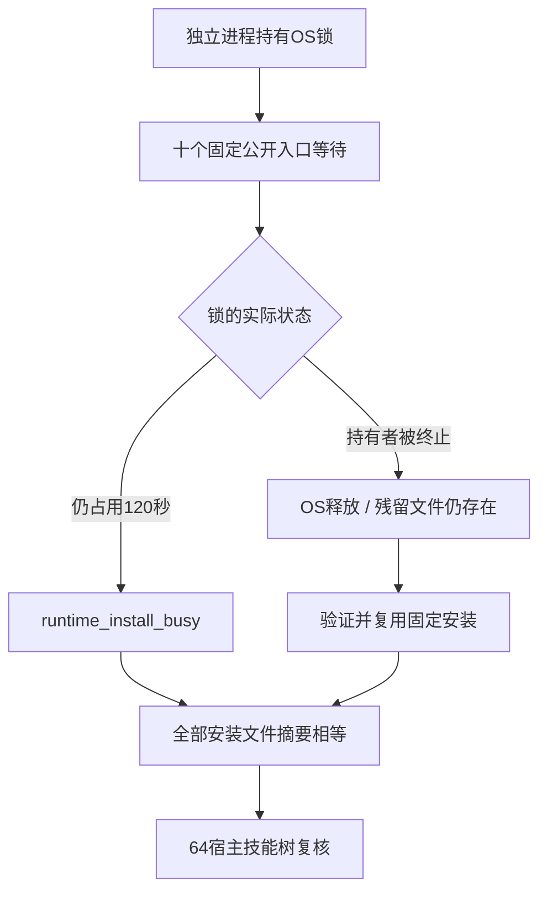

# ArtCraft 固定安装互斥验收架构

固定插件130／源102／runtime129的AC-RT-002-ART-INSTALL-LOCK场景已补齐当前发行验收；任务4.6整体仍开放。

测试直接运行宿主安装的十个公开Python CLI入口，未修改生产120秒超时。每个阶段由真实独立进程持有OS文件锁：十个入口均等待约120秒后返回runtime_install_busy，持锁者仍存活，安装文件不变。随后新持锁者退出，十个正在等待的入口取得锁、核验并复用原安装，返回固定runtime129版本；残留锁文件保持存在，证明活动锁依赖OS所有权释放。Node锁和组合安装锁各完成十次超时、十次退出复用，共40次实际公开调用。

原生编辑和渲染不在调用路径中；等待时不改变安装文件，也不发布新安装。当前空缓存下载及首用另由[固定升级分发](ArtCraft-Runtime-Upgrade-Distribution-Architecture.zh_CN.md)证明，不能把温缓存互斥测试称为重新下载。源码87与当前安装器逐字节比较表明Node安装器、下载模块和Node锁不变，组合安装器已经变化；因此本次真实固定入口复验覆盖了变化后的组合安装器，未直接沿用历史成功结论。

[固定互斥证据](evidence/fixed-mutex-acceptance130-20261009.json)保存40调用统计、安装文件数及摘要、前后64技能树校验、测试／原始证据摘要；原始命令参数和输出保留在隔离本地验收目录。实际使用Python3.14.8。测试显式环境启用，普通CI跳过真实耗时专项，不把跳过计为通过。

14场景审计仅将本场景更新为verified-current-installed。领域CLI自己的并行锁、缺失原生命令schema及其余历史分发证据仍需核对，4.6和完整V1不勾选。桌面工具再次初始化仍返回内核资源目录缺失，5.3的真实GUI修改验收继续开放。
