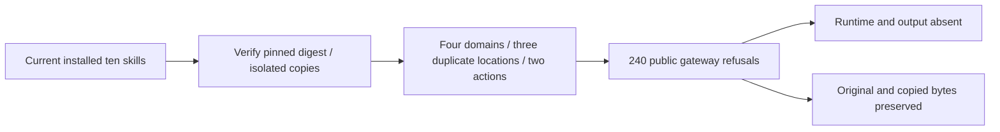

# ArtCraft Current Installed Strict Plan Acceptance Architecture

Current plugin130/source102 gateways pass240 duplicate-key refusals: ten actual installed skills, four domains, three duplicate locations (root, operation, params), and check/run actions. The opt-in test copies each skill independently into its own .agents/skills directory, verifies the current host-lock directory digest before and after execution, and retains separate stdout/stderr per call. Python3.13.5 on darwin-arm64 runs one test successfully with zero skips.

[Current evidence](evidence/current-plan-json130-20261009.json) binds the driver, raw proof and log hashes. This is actual installed public-entry rejection evidence; it does not exercise native saving, mixed revision or portable delivery. Those clauses and immutable bundle identities still need reconciliation with retained candidate/fixed proofs before the named PLAN-JSON scenario can close. Task4.6 remains open with six of14 scenarios verified and12 numbered tasks open. No runtime, skill production bytes or immutable releases changed.
