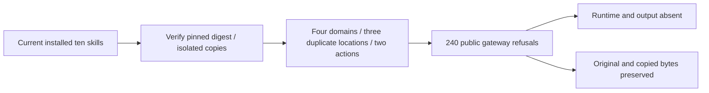

# ArtCraft Current Installed Strict Plan Acceptance Architecture

Current plugin130/source102 gateways pass240 duplicate-key refusals: ten actual installed skills, four domains, three duplicate locations (root, operation, params), and check/run actions. The opt-in test copies each skill independently into its own .agents/skills directory, verifies the current host-lock directory digest before and after execution, and retains separate stdout/stderr per call. Python3.13.5 on darwin-arm64 runs one test successfully with zero skips.

[Current evidence](evidence/current-plan-json130-20261009.json) binds the driver, raw proof and log hashes. This is actual installed public-entry rejection evidence; it does not exercise native saving, mixed revision or portable delivery. Those clauses were reconciled by the subsequent full verification below. Task4.6 remains open with seven of14 scenarios verified and12 numbered tasks open. No runtime, skill production bytes or immutable releases changed.

## Current full clause verification

The named PLAN-JSON scenario is now verified. A fresh single installed skill cold-downloads current public dependencies and passes3 tests in138.920seconds with22 logged calls: native four-domain source inspection/revision/reuse, frozen-plan refusal, native receipt integrity, moved four-child delivery and tampered variant restoration. Ten host skills and the copied skill retain pinned digests; all22 stdout/stderr hashes and original native project hashes are rechecked. Four live domain tags match locked commits; installed full bundle file hashes and34 core files match; all ten indices match and contain2646 commands. Retained candidate (publication NOT_RUN) and Art97 fixed proof remain separate, including original runtime83 identity. Later runtime129 migration uses a new immutable identity. No historical tags or assets were replaced. Seven of14 runtime scenarios are verified; task4.6 and12 numbered tasks remain open.

[Clause evidence](evidence/current-strict-plan-complete130-20261009.json).
