# ArtCraft JPEG Architecture

Status: working-tree candidate, not an immutable JPEG release. OpenSpec AC-CP-002-JPEG is the behavioral authority. Plugin dev.57 / source dev.40 / runtime dev.56 remain the published baseline.

## User outcome

A separately installed Art skill can register an existing JPEG product image by content, preserve its original bytes and produce a layered PhotoCraft project, PNG and PSD through the public Photo skill. A misleading binary filename is staged as a byte-identical `.jpg` after project ownership and revision checks. The staged dependency belongs to the portable project package.

## Components and data flow

```mermaid
flowchart LR
    U[Original JPEG] --> P[Python marker inspection]
    P --> M[MIME and encoded raster metadata]
    M --> O[Owner and revision binding]
    O --> S[Byte-identical jpg staging]
    S --> R[Node artifact verification]
    R --> C[Public PhotoCraft workflow]
    C --> D[pcraft, PNG, PSD and dependencies]
    D --> V[Moved package verification]
```

The Python helper is copied into all ten independent Art skills by `sync_skill_suite.py`; it uses only the standard library. The Node runtime has its own JPEG inspector and validates metadata without importing private skill code. Published plugin snapshots continue to come from immutable source tags.

## Supported contract

| Property | Contract |
| --- | --- |
| Identification | SOI bytes, not filename |
| Processes | Eight-bit SOF0, SOF1 and SOF2 |
| Components | 1, 3 or 4; unique IDs and valid sampling selectors |
| Structure | Segment bounds, frame header, scan selectors, stuffed/restart marker boundaries and final EOI |
| Metadata | Encoded width/height, bitDepth 8, alpha false |
| Limit | 64 MiB, bounded read; no entropy decoding allocation |
| Original | Full SHA-256 and byte count preserved |
| Staging | jpg only when native import requires a recognized suffix; exclusive copy and rehash |

Unknown binary behavior remains explicit. Fake jpg/jpeg files, truncated segments, duplicate frame headers, missing scans/EOI and declared metadata mismatches are rejected. Other processes, non-eight-bit samples, DNL and arithmetic coding are unsupported. Existing artifacts without JPEG property declarations still undergo marker inspection; present properties must match.

Marker inspection does not prove entropy decoding, EXIF orientation application, ICC fidelity or visual quality. A four-image synthetic corpus covers baseline RGB, progressive RGB, grayscale and CMYK. Native acceptance uses a progressive RGB fixture; it does not establish native CMYK or all JPEG fidelity.

## Verification and failure boundaries

TDD first reproduces generic-binary registration, malformed inputs reaching installation, and wrong dimensions/truncated JPEG being accepted by the runtime. Regression covers PNG and PCM behavior. A workflow test binds a wrong JPEG dimension and requires zero domain launches.

The cold first-use test copies only `artcraft-cli-execute`, starts with an empty runtime and restricted PATH, downloads the existing fixed public bundles, builds and reopens the Photo project, independently decodes JPEG/PNG/PSD, then moves and verifies its package. Candidate Node verification checks the actual staged JPEG separately. The installed public runtime in this candidate test remains dev.56; it is not proof of a published JPEG runtime. Source and copied-skill digests must remain unchanged.

## Release and remaining gates

Candidate evidence is `docs/evidence/jpeg-candidate-20261006.json`. Task 2.7 tracks implementation and candidate proof; task 2.8 tracks a new immutable runtime/source/plugin publication, provenance rebuild and installed-host cold tests. Do not update plugin vendored skills directly or claim dev.57 already contains this candidate. Full V1, model dispatch, GUI and creative acceptance remain open.
