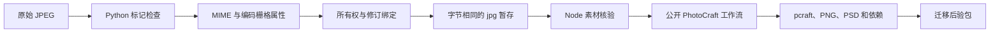

# ArtCraft JPEG 架构

状态：工作树候选，尚非 JPEG 不可变发行。行为事实源为 OpenSpec AC-CP-002-JPEG。已发布基线仍为插件 dev.57／技能源 dev.40／运行时 dev.56。

## 用户结果

单独安装的 Art 技能按内容登记已有 JPEG 产品图，保留原始字节，通过公开 Photo 技能交付分层工程、PNG 与 PSD。二进制扩展名的图片在项目所有权和修订检查后暂存为摘要相同的 `.jpg`，依赖进入可迁移交付包。

## 组件与数据流

Python 辅助脚本通过 `sync_skill_suite.py` 同步至十个独立 Art 技能，仅使用标准库。Node 独立实现属性核验，不导入技能内部代码。插件快照仍须来自不可变技能源标签。

## 支持合同

| 属性 | 合同 |
| --- | --- |
| 识别 | SOI 字节，不依赖文件名 |
| 编码过程 | 8 位 SOF0、SOF1、SOF2 |
| 分量 | 1、3、4；唯一 ID 与合法采样选择器 |
| 结构 | 段边界、帧头、扫描选择器、转义／重启标记边界及最终 EOI |
| 元数据 | 编码 width／height、bitDepth=8、alpha=false |
| 上限 | 64 MiB、有界读取；不分配熵解码内存 |
| 原文件 | 完整 SHA-256 和字节数保持 |
| 暂存 | 原生导入需要时才规范扩展名；独占复制并再次核验摘要 |

未知二进制行为保持明确。假 jpg/jpeg、截断段、重复帧头、缺失扫描／EOI、属性声明不符拒绝。其他过程、非 8 位、DNL 与算术编码明确不支持。未声明 JPEG 属性的旧产物仍检查标记，已声明属性逐项匹配。

标记检查不证明熵数据可解码、EXIF 方向已应用、ICC 保真或视觉质量。合成语料覆盖基线 RGB、渐进 RGB、灰度和 CMYK；原生交付测试使用渐进 RGB，不据此宣称原生 CMYK 或全部 JPEG 保真已验收。

## 验证与失败边界

TDD 先复现 JPEG 登记为通用二进制、损坏输入进入安装，以及运行时接受错误尺寸和截断 JPEG。回归保留 PNG 和 PCM 行为。工作流错误尺寸测试要求领域启动次数为零。

真实首次使用测试只复制 `artcraft-cli-execute`，空运行时、受限 PATH，下载既有公开固定制品，生成并重开 Photo 工程，独立解码 JPEG／PNG／PSD，移动交付包后验包。候选 Node 另外检查实际暂存 JPEG。该测试安装的公开运行时仍为 dev.56，不能当作 JPEG 新运行时发布证据。原图和复制技能的摘要必须不变。

## 发布与剩余门禁

候选证据为 `docs/evidence/jpeg-candidate-20261006.json`。任务 2.7 管理实现和候选验收，2.8 管理新不可变运行时／技能源／插件发布、来源重建和安装后冷启动测试。不得直接修改插件内技能快照，也不得宣称 dev.57 已包含本候选。完整 V1、模型调度、GUI 和创作验收继续开放。
