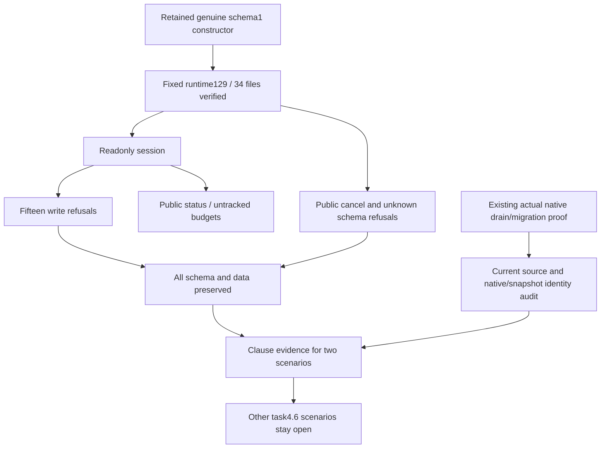

# ArtCraft Fixed Ledger Migration and Upgrade Clause Acceptance Architecture

The legacy ledger migration and public upgrade entry scenarios are now verified clause by clause for plugin130/source102/runtime129. Task4.6 remains open: six of14 scenarios are verified, with12 numbered tasks still open.

The new exercise constructs valid tasks/workflows using the retained genuine schema1 runtime, then loads the actual installed runtime129 TaskLedger module after verifying all34 runtime files. Fifteen readonly write refusals cover registration, ready, budget claim, unknown, cancel, execution preparation/attachment/exit/settlement, reviewReady, workflow budget creation, node write, packageSnapshot, and both cancelWorkflow outside the transaction wrapper and direct SQLite UPDATE. Complete schema and every table are compared after each refusal; historical budgets remain untracked. Public Python status reports untracked-legacy-schema, while public cancel returns runtime_upgrade_busy.

Public upgrade also rejects two nonempty controlled unknown-schema databases (0 and77), preserving all data. The final installed test passes in1.606seconds. The earlier narrower run and script copy are preserved; added unknown cases use a fresh output directory.

[Clause evidence](evidence/ledger-upgrade-complete130-20261009.json) combines the new readonly/unknown-schema probe, fixed130 actual native drain and compatible rollback,12 blocked migration cases and ten real independent cold upgrade calls. The native exercise is reused, not rerun: its original proof digest, native project, four old runtime files, snapshot SHA/0600 mode and compatible schema1 copy with review_ready task are reverified. Production core bytes are unchanged. Current pinned source proves task/lease/execution checks in the same SQLite write transaction and snapshot-before-DDL ordering; actual refusals/migration comparisons provide runtime evidence, without claiming concurrent-write stress testing.

Together these cover snapshot failure rollback/prior preservation, higher/unknown schema rejection, explicit compatible old-runtime copy selection, no new-ledger downgrade, no task replay and repeated upgrade without another snapshot. Actual ENOENT cold execution for every independent launcher remains in the prior ten-entry fixed proof; help text is not acceptance.

The new plugin test requires explicit environment; ordinary CI discovers and skips it. The skills repository mirrors docs/evidence only. Existing release assets remain unchanged; task4.6, public protocol, host and GUI work stay open, and OpenSpec is not archived.
