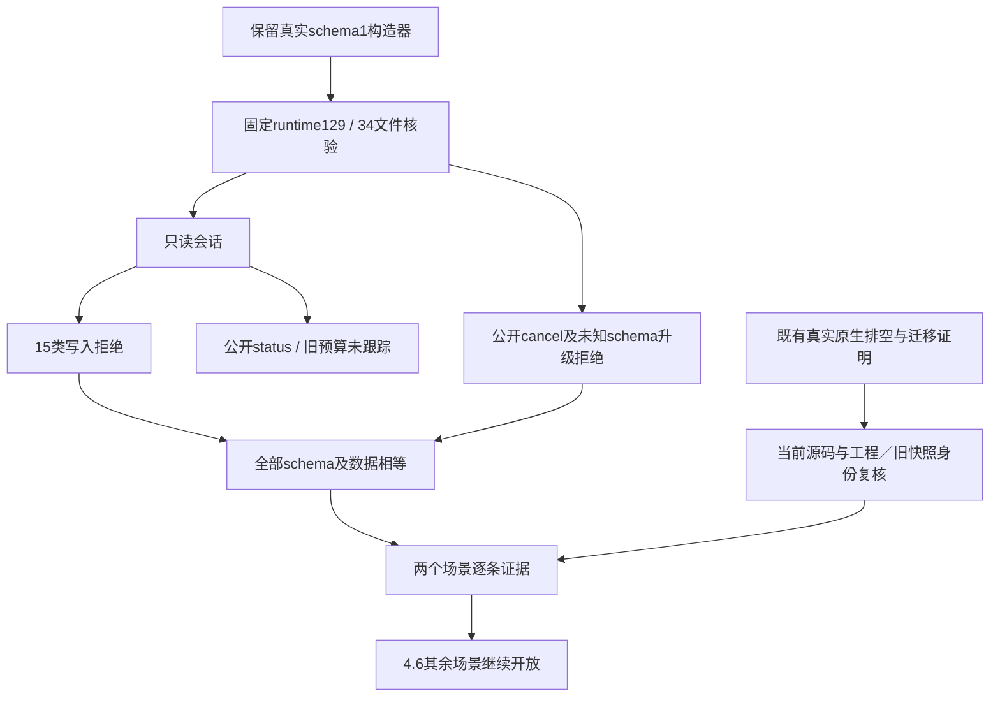

# ArtCraft 固定账本迁移与升级条款验收架构

插件130／源102／runtime129的旧账本迁移和公开升级入口两个场景已完成逐条验收。4.6整体仍开放：14场景累计六个通过，编号任务仍剩12项。

新增专项从保留的真实schema1运行时构建有效任务和工作流，再加载已安装runtime129的实际TaskLedger模块，核验该运行时34个文件。只读会话的15类拒写覆盖登记、ready、预算claim、unknown、取消、执行准备／登记／退出／结算、reviewReady、工作流预算登记、节点写入、packageSnapshot，以及绕过transaction包装的cancelWorkflow与直接SQLite UPDATE。每次均比对完整schema和所有表数据，旧预算返回空账户列表。公开Python status报告untracked-legacy-schema，公开cancel返回runtime_upgrade_busy。

新增公开upgrade还拒绝两个非空、受控未知schema数据库（0和77），全部数据保持不变。最终专项1项通过、耗时1.606秒；先前较窄专项和脚本副本保留，后续新增未知schema用新目录复验。

[逐条证据](evidence/ledger-upgrade-complete130-20261009.json)关联新增只读／未知schema、固定130原生排空与兼容回退、12类迁移边界、十独立技能实际冷调用等证明。既有原生专项不是重新执行：复用前核验原始证明摘要、原生工程、旧运行时四文件、旧快照SHA和0600权限，兼容复制件仍是schema1且原任务review_ready。生产核心字节未改变；同一SQLite写事务内检查任务／租约／执行、先快照后DDL由当前固定源码证明，真实拒绝与迁移数据核验提供运行证据，不宣称已做并发写入压力验收。

这两个场景覆盖快照失败回滚与原快照保全、高／未知schema拒绝、显式选择兼容旧版复制件、不降级新库、不重放及重复调用不产生第二快照。每个公开独立入口的实际ENOENT冷调用由既有十入口固定证据持有，不把help出现命令作为证明。

新增测试属于插件test目录，使用显式环境启用；普通CI发现后跳过安装专项。技能仓库仅镜像文档／证据。现有发行制品不变，4.6及其他公共协议／宿主／GUI任务继续开放，OpenSpec不归档。
