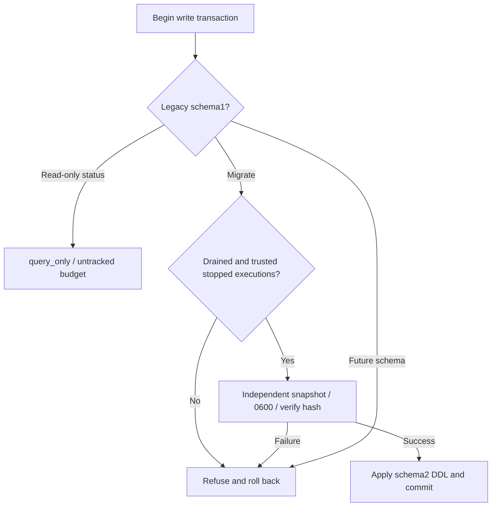

# ArtCraft ledger upgrade architecture

Runtime128 checks schema1 tasks, leases and executions inside the same SQLite write transaction. Undrained ledgers return `runtime_upgrade_busy` without rewriting prior state. Public `status` may inspect a legacy ledger read-only, explicitly reporting `untracked-legacy-schema` budgets without inventing historical allowances.

After draining, the runtime creates an independent mode0600 SQLite snapshot, verifies its application ID, schema version and integrity, and records SHA256 before migrating to schema2. Snapshot failure rolls back; existing snapshots are never overwritten. Future schemas refuse downgrade. Preserving a ledger snapshot does not provide automatic native-project rollback.

RED reproduced11 missing behaviors out of12 tests. All38 targeted tests passed; the runtime suite passed298 of319 with21 conditional skips. An intermediate assertion incorrectly compared SQLite row prototypes; it was corrected with the original log retained. See [evidence](evidence/ledger-upgrade-20261009.json).

Release chain: runtime128, independent skill source100 and plugin128. Domain dependencies retain their existing locks. Earlier127/99/126 evidence retains its original scope. Fixed installation and the native upgrade matrix require separate evidence. All14 outstanding tasks remain open; OpenSpec is not archived and complete V1 acceptance is pending.
