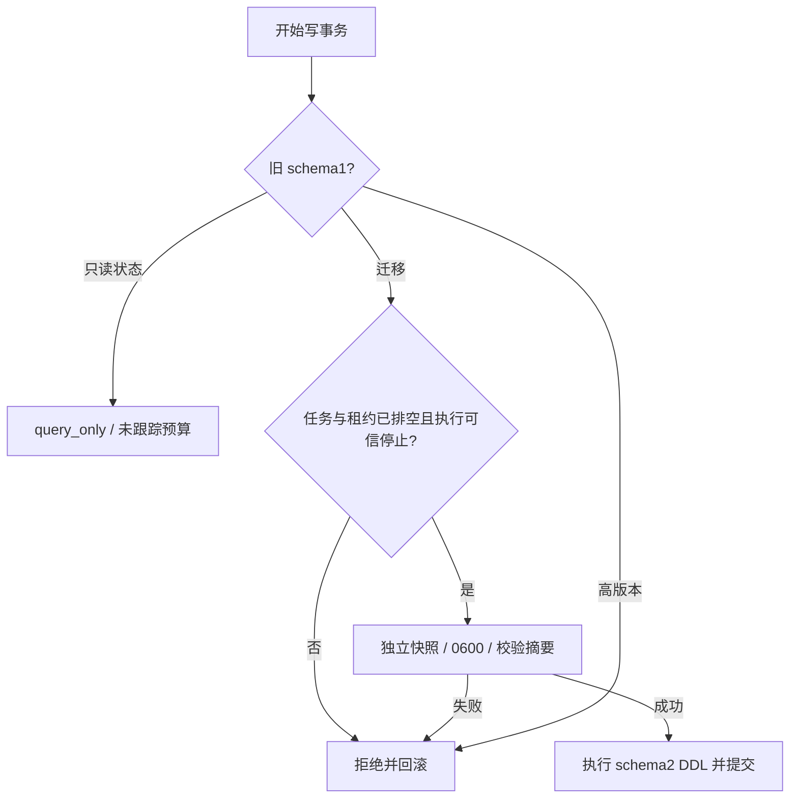

# ArtCraft 账本升级架构

本开发版 runtime128 在同一 SQLite 写事务内检查旧 schema1 的任务、租约和执行记录。未排空时返回 `runtime_upgrade_busy`，不改写旧状态。公开 `status` 可以只读查询旧账本，预算标注 `untracked-legacy-schema`，不补造历史额度。

排空后先建立权限0600的独立 SQLite 快照，检查 application_id、schema版本和完整性并记录 SHA256，然后迁移到 schema2。快照失败回滚，已有快照不覆盖；高版本 schema 拒绝降级。快照保全不代表原生工程自动回滚。

红灯12项中11项复现缺陷；目标38项通过；完整运行时319项中298项通过、21项条件跳过。首轮实现中另有一项测试对SQLite行对象原型的断言错误，已修正并保留日志。证据见 [结构化记录](evidence/ledger-upgrade-20261009.json)。

发行链：runtime128、独立技能源100、插件128。领域依赖保持现有锁。新包不覆盖旧发行。固定安装与原生升级矩阵需要独立证据，既有127／99／126验收仅代表其原始身份。本次不关闭剩余14项任务，不归档OpenSpec，完整V1未完成。

发行验证：10个独立空缓存CLI入口与1项真实四领域版本绑定／复用／移动包测试通过。运行时298通过／21跳过，技能源149通过／52跳过，插件106通过／6跳过。准确宿主安装与完整原生升级验收继续单独记录。[证据](evidence/release128-verification-20261009.json)。
