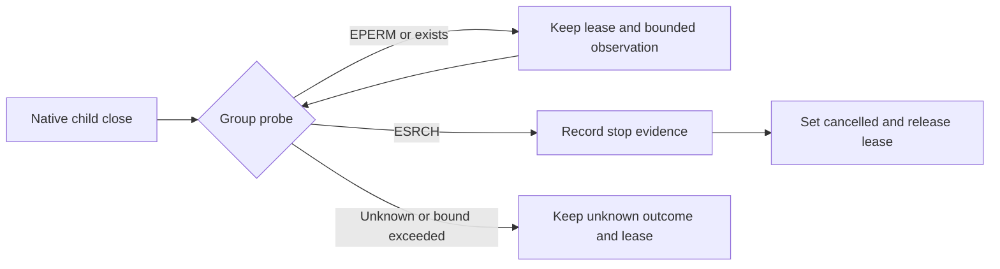

# ArtCraft live native cancellation

Plugin dev.44 / runtime dev.41 has a confirmed first-use cancellation defect. Two isolated public installations started a real EffectCraft render and requested cancellation. The native launcher closed on SIGTERM, but the supervisor recorded `groupStopped=false`; the workflow remained `cancel_requested`.

Source diagnosis observed EPERM from the process-group existence probe after child close. An existence permission error is not proof of absence. The repair treats the group as possibly existing and continues the existing bounded observation. Only the bound child close and a later confirmed group absence allow final cancellation and lease release. Other probe errors and signal permission failures still preserve unknown status.

Source tests cover permission-denied existence, actual absence and other errors, plus a real installed native skill cancellation. The native source case fails before the repair and passes afterwards. Target regression: 26 passes. Full Node regression: 137 passes, six skips; independent skill regression: 66 passes, 15 skips. [Evidence](evidence/live-cancel-source-fix.json).

The existing immutable public release is unchanged and still contains the defect. New runtime/skill/plugin publication and default-public first-use retesting are pending in OpenSpec task 5.14. The installed first-use test is `tests/test_live_cancel_first_use.py` in the skill repository; source/native regression is `test/native_cancel_runner.test.ts` in the plugin repository. No successful live first-use claim is made for the repaired source before publication.
