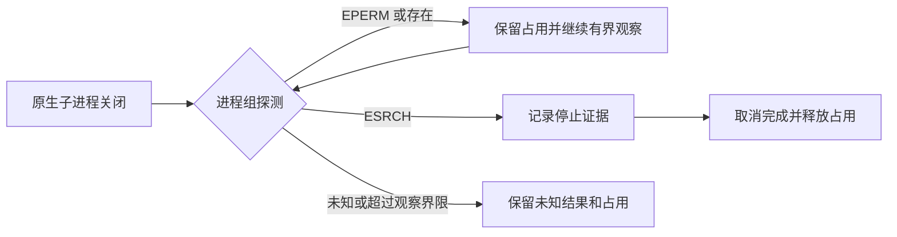

# ArtCraft 原生运行中取消方案

固定插件 dev.44／运行时 dev.41 已确认首次使用取消缺陷。两次隔离公开安装均启动真实 EffectCraft 渲染并提交取消；原生启动器收到 SIGTERM 后关闭，但监督器记录 `groupStopped=false`，工作流停留在 `cancel_requested`。

源码诊断观察到子进程关闭后的进程组存在性探测返回 EPERM。存在性权限错误不能证明组消失。修复将组保守视作可能存在，继续已有的有界观察；只有绑定子进程的 close 与之后确认进程组消失，才允许最终取消和释放占用。其他探测错误、发信号权限失败继续保留未知状态。

源码测试覆盖存在性权限失败、实际不存在和其他错误，以及安装后的真实原生技能取消。原生源码用例修复前失败、修复后通过；目标回归 26 项通过。完整 Node 回归 137 项通过、6 项跳过，独立技能回归 66 项通过、15 项跳过。[证据](evidence/live-cancel-source-fix.json)。

现有不可变公开发行未修改，仍包含该缺陷。新运行时／技能／插件发布与默认公开首次使用复验在 OpenSpec 5.14 中保持待完成。实际安装用例位于技能源仓 `tests/test_live_cancel_first_use.py`；源码原生回归位于插件仓 `test/native_cancel_runner.test.ts`。发布前不宣称修复源码已通过公开首次使用。
