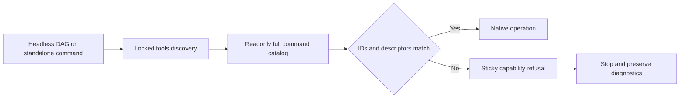

# ArtCraft live command contract architecture

Development checkpoint134/source106/runtime133 extends the existing tool-schema boundary with the complete locked native command registry (2646 IDs). Before editing, a session queries the full readonly catalog and compares command IDs, parameter descriptions and presence of the params field. Duplicate/missing/extra IDs, invalid JSON, changed descriptions and query failures refuse with capability_missing. Context fields such as enabled, labels and menus do not participate. Positive discovery is cached per session; explicit catalog queries revalidate. A caught refusal stays sticky; no request is retried.

The standalone skill carries its own native_contract.py in each of ten independent skills. Domain files remain unchanged. The DAG embeds the same Python boundary. The task ledger promotes a bounded native capability_missing diagnostic only after process-group stop is verified; other failures retain their existing mapping. Ambiguous duplicate error fields are not promoted.

The local runtime regression passes380 tests with25 conditional skips. Sixty controlled command contract cases pass. Twenty actual native readonly catalog probes pass with controlled corruption;36 native post-save protocol faults also pass against candidate Art code and fixed133 native dependencies. These are candidate/runtime evidence, not a new fixed host or mixed creative acceptance. [Evidence](evidence/command-schema-checkpoint-20261009.json).

Independent bridge and desktop routes retain their existing behavior and are outside this new headless contract enforcement. Task4.6 stays open, as do the other outstanding tasks. No formalV1, GUI or complete platform acceptance is claimed. Existing historical evidence remains tied to its original release.
