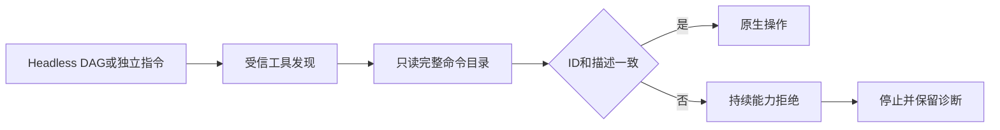

# ArtCraft 实际命令合同架构

开发检查点134／源106／runtime133在既有工具schema边界上增加完整原生命令目录校验（2646个ID）。每个会话编辑前只读查询完整目录，比较命令ID、参数描述和params字段是否存在。缺失、重复、额外ID、无效JSON、描述漂移及查询失败均以capability_missing拒绝；enabled、标签、菜单等上下文字段不参与比较。成功发现按会话缓存；显式完整目录查询重新校验。捕获异常后拒绝仍生效，不自动重试。

十个独立技能均携带自包含native_contract.py，领域文件原字节保留。DAG嵌入相同Python边界。任务账本仅在进程组停止已核实时提升有界capability_missing诊断；其他故障保持已有映射。含重复error字段的歧义响应不提升为可信错误码。

本地运行时380项通过、25项条件跳过；60项受控命令合同用例通过。实际原生只读目录20项探针（含受控篡改）通过；候选Art代码结合固定133原生依赖的36项保存后协议故障通过。这些属于候选／运行时证据，不能代替新固定宿主和混合创作验收。[证据](evidence/command-schema-checkpoint-20261009.json)。

独立bridge／desktop保留既有路径，尚未纳入这次headless合同强制校验。任务4.6及其他未完成任务保持开放；不声明正式V1、GUI或全平台验收完成。历史证据保留原版本边界。
