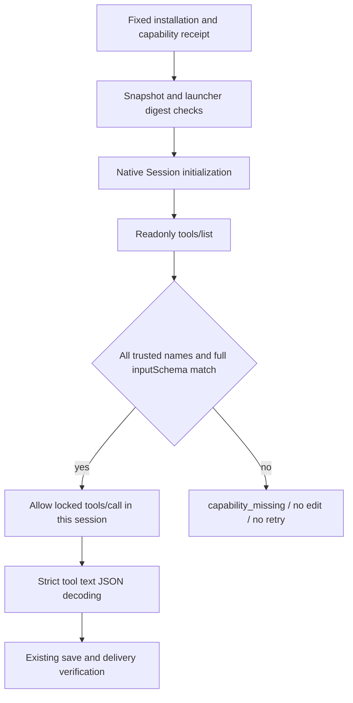

# ArtCraft Live Tool Schema Boundary Architecture

Four-domain DAG edits must bind actual runtime capabilities. Fixed plugin132/source104/runtime131 binds script and binary identities but does not discover native tool schemas before workflow.py sends its first tools/call. The candidate adds this boundary in the Art-owned launcher while preserving domain bundle bytes. AC-RT-002-LIVE-TOOL-SCHEMA is the specification authority; task4.18 and overall4.6 remain open pending fixed distribution acceptance.

## Components and trust

| Component | Responsibility | Refusal |
|---|---|---|
| Independent skill setup.py | Include references/native-command-snapshot.json in files and capabilitySnapshot.scriptHashes | Missing file prevents receipt creation |
| publicSkillFactory | Require the locked snapshot path and verify its digest; supervised launch checks identity again | capability_missing for unlocked snapshot, launcher_file_identity_mismatch for tampering |
| strictMcpRunner | Read the trusted domain snapshot and discover tools in the same native Session before editing | capability_missing on missing, duplicate, malformed or incompatible tools |
| Domain Session | Native protocol, save and export | Preserve native errors and strict response handling without retries |

## Runtime contract

All snapshot tool names and complete inputSchema values must match. Object key ordering is immaterial; JSON type differences still refuse. Additional native tools do not widen the launcher's callable set. Malformed or incomplete paginated discovery is refused. Successful discovery is cached per session; explicit tools/list always revalidates. Catching a refusal cannot restore editing or trigger discovery retries.

The wrapper targets only the trusted absolute mcp_session.py location and retains domain bytes and existing nonfinite, overflow and duplicate-key response refusal. The existing DAG bridge boundary remains; independent explicit bridge/desktop command entry points remain separate. Tool schema agreement does not establish acceptance of every command parameter, UI operation or business scenario.

## Evidence and remaining work

Actual readonly discovery finds78 matching tools across four domains. Twenty installed fixed132 readonly probes never send tools/list, leaving16 planned faulty-discovery branches unreached. This proves omitted discovery, not execution against a truly faulty native tool. Twenty candidate probes discover the actual native tools before QA injects missing, drifted, duplicate or malformed results. All16 refusal cases send no tools/call; four positive cases only query command catalogs.

The first behavioral unit run has9 failures/1 pass; the final target set passes14/14. An initial fixture newline error is retained separately and is not counted as product RED. Runtime regression passes315 with25 conditional skips; the final three added tests pass in the target set. Skill-source regression passes152/204 with52 conditional skips. Two candidate native mixed tests pass in37.430 seconds, covering direct and full-command gateway creation, revision, reuse and moved packaging.

[Candidate evidence](evidence/live-tool-schema-candidate-20261009.json) binds source and logs. New immutable releases, installed binding and refusal, ten independent cold first uses, and fixed mixed/fault acceptance remain pending. Task4.18 cannot close from candidate tests. Existing published versions remain unchanged. CompleteV1, GUI, actual Skills CLI and other platforms remain unqualified; OpenSpec is not archived and no marketplace promotion occurs.
