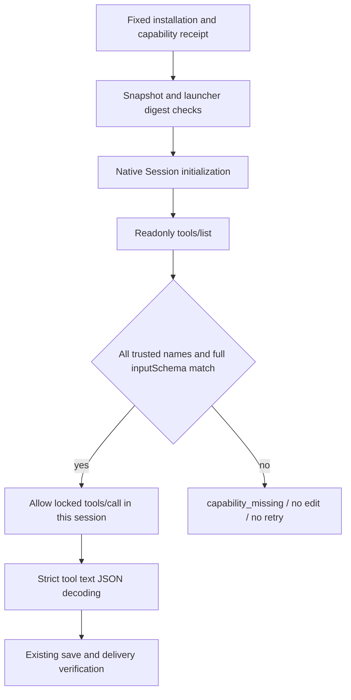

# ArtCraft Live Tool Schema Boundary Architecture

Four-domain DAG edits must bind actual runtime capabilities. Earlier fixed plugin132/source104/runtime131 binds script and binary identities but does not discover native tool schemas before workflow.py sends its first tools/call. The candidate adds this boundary in the Art-owned launcher while preserving domain bundle bytes. AC-RT-002-LIVE-TOOL-SCHEMA is the specification authority; fixed133/source105/runtime132 now completes task4.18; overall4.6 remains open.

## Components and trust

| Component | Responsibility | Refusal |
|---|---|---|
| Independent skill setup.py | Include references/native-command-snapshot.json in files and capabilitySnapshot.scriptHashes | Missing file prevents receipt creation |
| publicSkillFactory | Require the locked snapshot path and verify its digest; supervised launch checks identity again | capability_missing for unlocked snapshot, launcher_file_identity_mismatch for tampering |
| strictMcpRunner | Read the trusted domain snapshot and discover tools in the same native Session before editing | capability_missing on missing, duplicate, malformed or incompatible tools |
| Domain Session | Native protocol, save and export | Preserve native errors and strict response handling without retries |

## Runtime contract

All snapshot tool names and complete inputSchema values must match. Object key ordering is immaterial; JSON type differences still refuse. Additional native tools do not widen the launcher's callable set. Malformed or incomplete paginated discovery is refused. Successful discovery is cached per session; explicit tools/list always revalidates. Catching a refusal cannot restore editing or trigger discovery retries.

The wrapper targets only the trusted absolute mcp_session.py location and retains domain bytes and existing nonfinite, overflow and duplicate-key response refusal. The existing DAG bridge boundary remains; independent explicit bridge/desktop command entry points remain separate. Tool schema agreement does not establish acceptance of every command parameter, UI operation or business scenario.

## Evidence and remaining work

Actual readonly discovery finds78 matching tools across four domains. Twenty installed fixed132 readonly probes never send tools/list, leaving16 planned faulty-discovery branches unreached. This proves omitted discovery, not execution against a truly faulty native tool. Twenty candidate probes discover the actual native tools before QA injects missing, drifted, duplicate or malformed results. All16 refusal cases send no tools/call; four positive cases only query command catalogs.

The first behavioral unit run has9 failures/1 pass; the final target set passes14/14. An initial fixture newline error is retained separately and is not counted as product RED. Runtime regression passes315 with25 conditional skips; the final three added tests pass in the target set. Skill-source regression passes152/204 with52 conditional skips. Two candidate native mixed tests pass in37.430 seconds, covering direct and full-command gateway creation, revision, reuse and moved packaging.

[Candidate evidence](evidence/live-tool-schema-candidate-20261009.json) binds source and logs. At the candidate checkpoint those release/install gates were pending; they are verified below. Candidate tests alone did not close task4.18. Historical published assets remain unchanged. CompleteV1, GUI, actual Skills CLI and other platforms remain unqualified; OpenSpec is not archived and no marketplace promotion occurs.

## Fixed distribution acceptance

Plugin133/source105/runtime132 installs in isolated Codex0.147.0 with5 plugins/64 skills and zero loading errors. All64 skill trees and all five complete bundles rehash after use. Ten independent empty-runtime/system-PATH first uses pass in196.082 seconds, including public version/help discovery and actual missing-ledger upgrade refusals. Three prerelease asset digests and exact five-bundle rebuilds match.

The installed setup receipt binds four tool snapshots in launcher files and capability hashes. Unlocked snapshots, incorrect digests and unsupported DAG bridge modes refuse before output creation. Twenty installed native discovery probes pass: four readonly catalog queries and16 controlled missing/drift/duplicate/malformed refusals without tools/call. Independent headless/bridge/desktop structural checks pass with nativeExecution=NOT_RUN; no GUI claim is made.

The fixed mixed suite passes3 tests in164.742 seconds: one complete native integration and two archive-argument tests. It covers creation, source revision/reuse, frozen-plan refusal, Photo variant tamper/restoration and a four-child moved package. The optional driver summary variable was omitted; all22 retained response pairs were independently audited and hashed with the exact passing driver source/log. The reconstructed summary does not claim unrecorded argv or per-call exit codes. Thirty-six installed post-save faults pass in16.327 seconds, preserving/reopening original stages, blocking consumers and preventing replay;81 retained files rehash.

CI runs343 runtime tests (318 pass/25 conditional skips); Python regressions pass152/204 skills and112/123 plugin tests, with52/11 conditional skips. Initial stale guide/source-plan failures are retained separately before correction. [Fixed evidence](evidence/fixed-live-tool-schema-distribution133-20261009.json) closes only4.18. [Scenario audit](evidence/runtime-upgrade-scenario-audit133-20261009.json) supports14/16 scenarios, including4 current installed and10 explicitly justified unchanged-code references. Generic4.6 remains open: all2646 command IDs/parameter descriptors agree in readonly native catalogs, but this launcher does not yet enforce their drift refusal. Twelve numbered tasks remain open; completeV1 is not claimed.
