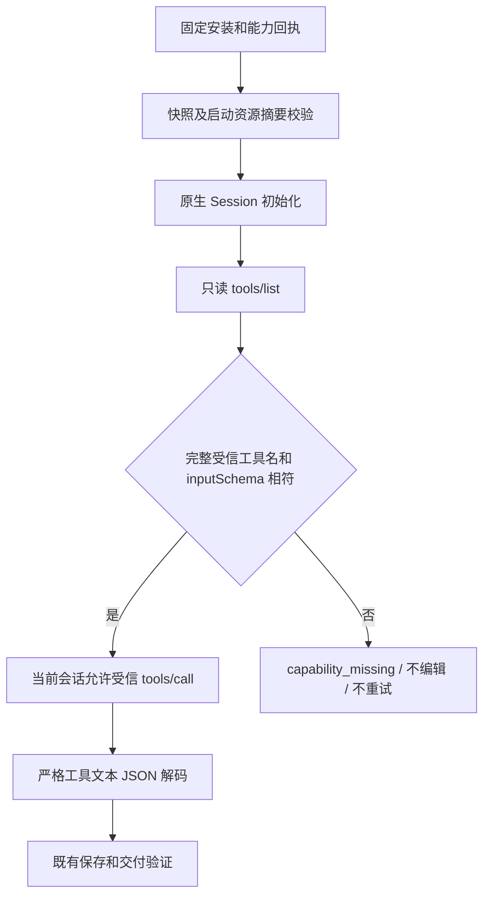

# ArtCraft 实际工具 Schema 边界架构

目标是让四领域 DAG 的编辑请求绑定实际运行能力。当前固定插件132／源104／runtime131 只约束脚本与二进制身份，未在领域 workflow.py 首次 tools/call 前核对原生工具 schema。候选在 Art 自有启动器补上这一边界；领域包保持原字节。正式规格为 AC-RT-002-LIVE-TOOL-SCHEMA，任务4.18及整体4.6保持开放，等待新固定分发安装验收。

## 组件与信任来源

| 组件 | 职责 | 失败行为 |
|---|---|---|
| 独立技能 setup.py | 将 references/native-command-snapshot.json 纳入 files 与 capabilitySnapshot.scriptHashes | 缺少文件拒绝安装回执生成 |
| publicSkillFactory | 只接受已锁定的快照路径，校验其摘要；受监督进程启动前再次校验启动身份 | 未锁定返回 capability_missing，篡改返回 launcher_file_identity_mismatch |
| strictMcpRunner | 从受信领域目录读取快照；同一 Session 首次编辑前只读发现工具 | 工具缺失、重复、无效或 schema 不符返回 capability_missing |
| 领域 Session | 实际原生协议、保存与导出 | 保留原生错误和已有严格响应拒绝，不重试 |

## 运行合同

快照中全部工具名和完整 inputSchema 必须匹配；JSON对象字段顺序不影响比较，类型差异仍拒绝。原生附加工具可以被发现，但不能成为当前启动器允许调用的新工具。无效或分页不完整的列表不被当作完整合同。每个会话首次 tools/call 前发现一次，正常结果在该会话复用；显式 tools/list 始终重新校验。拒绝状态不会因调用者捕获异常而恢复，禁止自动重试发现或编辑。

仅包装受信绝对路径对应的 mcp_session.py，保留领域资源原字节与原有非有限值、溢出和重复键响应拒绝。DAG bridge 模式仍按已有边界拒绝；独立完整命令的显式 bridge／desktop 入口保持独立。本变更核对工具合同，不代表所有命令参数、UI操作或业务场景已经验收。

## 当前证据与差距

四领域实际只读发现共78个工具，其 schema 与固定快照一致。旧固定132父边界的20个原生只读探针均没有发送 tools/list；其中16个计划中的异常发现分支未被触达，证明发现缺口，不冒充真实错误工具执行。候选20个探针先完成实际发现，再在QA层注入缺失、漂移、重复或畸形列表；16拒绝分支没有 tools/call，4正常分支只查询命令目录。

新边界测试首次9失败／1通过，修复后最终目标14项全部通过；最初夹具换行转义错误单独保留，未计为产品红灯。完整运行时回归315通过／25条件跳过；最后新增三测试另在目标集通过。技能源204项中152通过／52条件跳过。两条候选真实混合测试37.430秒通过，覆盖直接及完整命令网关的四领域创建、返工、复用与移动包。

证据：[候选记录](evidence/live-tool-schema-candidate-20261009.json)。安装副本验证、新不可变发行、十技能独立冷首用和固定混合／故障复验仍待完成，不能用候选测试关闭4.18。当前既有发行继续有效，尚未发布本候选。完整V1、GUI、实际Skills CLI及其他平台门禁保持开放；OpenSpec不归档，不推广到正式市场。
