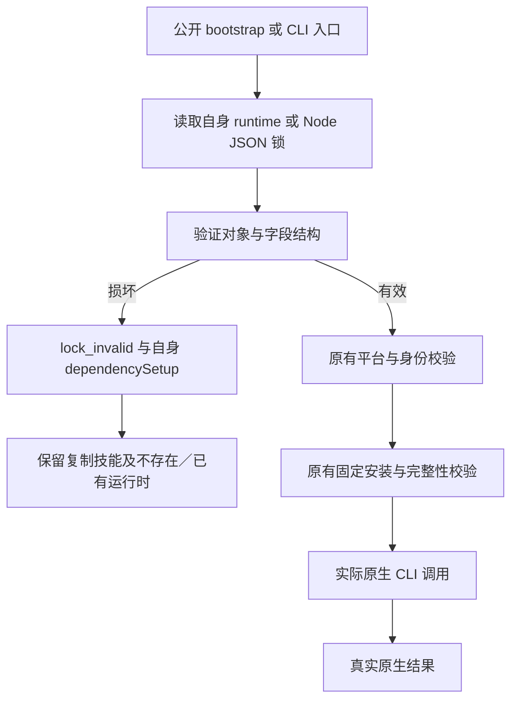

# 运行时锁结构诊断候选实现

JSON 语法有效不代表锁结构有效。修复前，null／数组根对象、缺少键或错误字段类型可能直接泄露内部异常；错误的二进制摘要类型还可能先创建目录、下载，再拒绝。公开首次使用入口因此无法稳定返回约定的本地恢复诊断。

## 候选行为

四领域安装器在文件系统变化前校验运行时根对象、制品映射、制品名／版本类型及当前平台制品对象。当前平台制品要求字符串 URL、归档／二进制小写 SHA-256，以及类型正确的可选版本输出／来源摘要字段。缺少当前平台仍返回 `unsupported_platform`；存在但结构损坏的平台对象返回 `runtime_lock_invalid`。原有来源地址、安全解压、摘要、原生版本、安装回执、有界下载及保全校验继续生效。

ArtCraft 在平台／版本校验或创建目录前，校验 Node 锁根对象、schema 和字段类型，结构错误返回 `node_lock_invalid`。分发锁提前校验由下方后续实现及证据覆盖。

错误沿用已有 JSON 失败回执，携带当前技能自身的绝对 bootstrap 路径、请求运行时目录和 `automaticRetry=false`。不执行原生命令、不选择兄弟技能、不覆盖损坏安装。安装成功之后的原生失败仍保留原生错误语义。

## 证据边界

测试先在五套技能源复现缺失行为。修复后的公开子进程测试覆盖 bootstrap 和 CLI 的损坏根对象与字段；另将64项技能源各自独立复制，在不存在和已有运行时下分别调用两个入口，null 锁共256次实际调用。每项复制技能和既有用户标记文件均保留。正常锁的候选原生测试另覆盖四领域保存重开、导出、源返工，以及 Art 混合创建、返工、复用和移动交付。

证据：`docs/evidence/craft-candidate-lock-shape-diagnostics-20261007.json`，绑定脚本、技能和测试摘要、RED 观察及当前候选结果。64项技能共享资源已同步。已发布插件仍收录此前不可变快照；候选源码通过不代表新固定发行安装已通过。

现有 OpenSpec `*-SK-003-SETUP-FAIL` 场景记录结构拒绝边界，不关闭完整任务。剩余工作包括不可变技能源／插件发行、固定安装复验、实际通用 Skills CLI 安装及完整命令／场景和创作验收。其他平台与生产未验证。

## Distribution preflight candidate / 分发提前校验候选

Art source now validates distribution root/schema/version and all five bundle objects before install_node. Bundle filenames, URLs, digest/file maps, versions and archive-format fields are checked without filesystem writes or downloads. The same validator is reused by setup and direct bundle installation. Node-only setup remains independent of distribution. Two RED tests reproduced sixteen failures; two target tests and 109 source regressions now pass (34 opt-in skips). New bundled-domain normal-lock native acceptance and fixed installed publication remain open.

Art 源码现在在 install_node 前校验分发根对象、schema、版本和全部五个制品对象，无写目录或下载地校验文件名、URL、摘要／文件映射、版本及归档格式；setup 和直接制品安装复用同一校验。node-only 仍独立于分发锁。两项 RED 测试复现十六次失败；两项目标测试及109项源回归通过（34项显式环境测试跳过）。新领域捆绑正常锁原生验收及固定安装发行仍未完成。

[Evidence / 证据](evidence/artcraft-distribution-preflight-candidate-20261007.json).

## New fixed-domain candidate verification / 新固定领域候选验证

All ten Art skills reject null distribution locks through both public entries with absent and existing runtimes (40 calls), preserving skill and user files. The new published Film30, Effect31, Photo31 and Vector30 bundles pass the fresh online mixed workflow (3 tests, 134.389 seconds), including native creation, revision, reuse and moved delivery. Full source regression: 143 tests, 109 passed, 34 opt-in skips. Runtime83 bytes remain unchanged. Fixed installed plugin acceptance is still pending.

10 个 Art 技能以两个公开入口、缺失和已有运行时执行40次 null 分发锁检查，保留技能和用户文件。新发行 Film30、Effect31、Photo31、Vector30 在全新在线混合工作流中通过3项测试（134.389秒），覆盖原生创建、返工、复用和移动交付。完整源回归143项，109通过、34项显式环境测试跳过；Runtime83字节保持一致。固定插件安装验收仍待执行。
