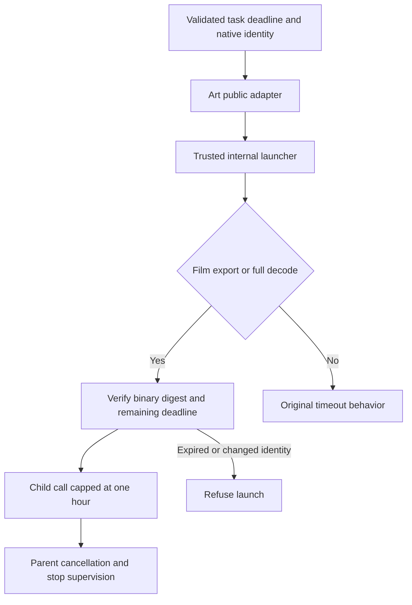

# ArtCraft long export budget architecture

This development release identifies plugin137 / independent source109 / runtime136-runtime.1. Only the Art-owned launch boundary changes; domain files, catalogs and other plugins retain their pins.

## Problem and behavior

An actual fixed136 public Film long-timeline run failed after approximately181seconds at the domain's180-second export timeout. The failed receipt published no output references. Native project, checkpoint and recovery operations were retained. The incomplete movie was reversibly compressed with a verified decompressed digest. This is failure evidence, not successful full export acceptance.

The public adapter forwards the current task deadline and locked Film executable identity through an internal launch argument. A module-local subprocess proxy grants only Film `export` and `bench-decode` the remaining deadline budget, capped at3600seconds per call. Other calls retain their timeout behavior. Domain source bytes and global subprocess behavior remain unchanged.

## Verification and delivery limits

New tests cover command scope, changed identity, expired/short deadlines, the one-hour cap, and an actual OS child showing baseline timeout followed by budgeted success. Adapter tests verify that only Film receives trusted parameters from the current request. All ten independent skills synchronize the launch boundary; the plugin vendors an immutable source snapshot.

The opt-in public long-timeline test preserves12fps and the original large integer tick range. It requires full export and independent whole-movie decode. Disk constraints prevent a new large-file run during this release. OpenSpec task2.3 and full V1 remain open. The prerelease delivers the fix and executed regression evidence; new-distribution host first use, native long-movie acceptance and the complete task matrix remain unverified.

## Specification and compatibility

The authority is AC-CP-002-TIME-BUDGET in `establish-v1-plugin` / `craft-artifact-protocol`. Public task/artifact protocol versions do not change. Domain plans cannot choose the internal budget. Parent cancellation, failed-stage retention, confirmed stopping and no automatic replay continue to apply. Vector duplicate-command refusal is preserved. Existing tags and assets remain immutable.

[Regression evidence](evidence/long-export-budget137-20261009.json): runtime630 PASS /26 skips; source162 PASS /52 skips; targeted budget3 PASS.

[Native one-second public workflow smoke](evidence/short-native-film137-20261009.json):12 independently decoded frames PASS on runtime136; source entry, not fixed-host installation or long-timeline acceptance.
