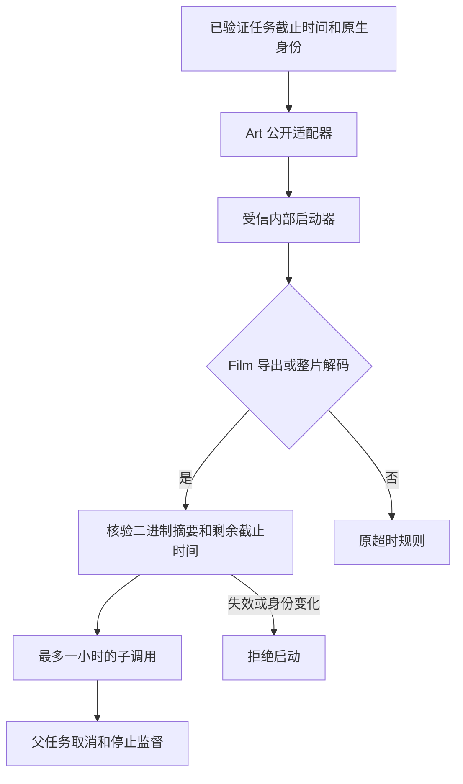

# ArtCraft 长导出预算架构

本次开发发布为插件137／技能源109／运行时136-runtime.1。范围仅为 ArtCraft 自有启动边界；四领域文件、命令目录和其他插件保持原版本。

## 问题与行为

固定插件136公开入口的原生 Film 超长时间线任务在约181秒失败：领域导出调用默认180秒，任务回执失败且没有发布输出引用。原生工程、检查点和恢复操作记录保留；未完成影片经可逆压缩保存，校验解压摘要一致。这是失败证据，不是整片导出通过。

Art 适配器将本次任务的截止时间、已锁定的 Film 可执行文件路径和摘要交给内部启动器。启动器只为 Film `export` 与 `bench-decode` 分配剩余时间，单次上限3600秒；其他调用保持原有规则。使用模块局部 subprocess 代理，不修改领域源码，也不全局替换 subprocess。

## 验证与交付边界

新增测试覆盖命令范围、身份变化、过期截止时间、短截止时间、一小时上限，以及真实操作系统子进程的原超时失败／预算内成功。适配器测试核对只有 Film 接收当前请求的受信参数。全部十个独立技能同步启动边界，插件通过不可变快照接收技能源。

新增超长时间线公开入口验收保持原12fps和大整数时间范围，需要完整导出及独立整片解码。由于磁盘限制，本次不启动大文件复测，未将其标记通过；OpenSpec任务2.3及完整V1仍开放。开发发布只交付修复与已执行的回归证据。新发行包的宿主首用、长影片原生验收和完整任务矩阵仍待验证。

## 规格与兼容性

事实源为 `establish-v1-plugin` 中 `craft-artifact-protocol` 的 AC-CP-002-TIME-BUDGET。未改变公开任务／产物协议版本；内部预算参数不可由领域计划指定。父任务取消、失败暂存、停止确认和禁止自动重放规则继续适用。Vector重复命令拒绝规则保留。发布保留所有历史标签和资产。

[Regression evidence](evidence/long-export-budget137-20261009.json): runtime630 PASS /26 skips; source162 PASS /52 skips; targeted budget3 PASS.

[Native one-second public workflow smoke](evidence/short-native-film137-20261009.json):12 independently decoded frames PASS on runtime136; source entry, not fixed-host installation or long-timeline acceptance.
