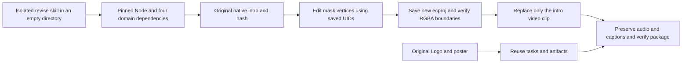

# ArtCraft Mixed Mask Revision Architecture

Skill suite dev.13 pins EffectCraft skills dev.6 (native CLI 0.2.0); plugin snapshot dev.15 retains orchestration runtime dev.13. The dependency ZIP is built from the independent immutable source tag, with archive/file hashes and byte size in each ArtCraft skill's own distribution lock. Existing release assets remain unchanged.

Creation saves the `mask.new` UID and layer binding. Revision binds the source artifact's native hash through externalInputs and does not recreate the document. A mask-only edit declares no unused new Logo input; existing native assets remain packaged with the source delivery. Vertices use layer coordinates.

FilmCraft revises the prior native video by replacing the saved intro clips. Acceptance compares every original project file hash, opacity keys, audio structure, caption bytes, actual RGBA alpha coverage and task identity. Repeating the revision reuses tasks and budget allocation. The delivery package retains four editable native child projects.

The online reproduction with the old dependency fails at intro revision and blocks its consuming video while reusing Logo/poster tasks. The independent source adds tests/test_mask_revision_first_use.py. Technical evidence does not establish creative approval, automatic roto or arbitrary complex-path fidelity. This workflow uses no paid generation service or cross-editor conversion.
