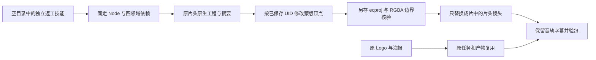

# ArtCraft 蒙版混合返工架构

技能套件 dev.13 固定 EffectCraft 技能 dev.6（原生 CLI 0.2.0）；插件快照 dev.15 保持编排运行时 dev.13。依赖 ZIP 从 EffectCraft 独立仓库固定标签生成，归档、文件摘要和字节数进入每个 ArtCraft 技能自己的分发锁。已有发布制品不被覆盖。

创建片头时保存 `mask.new` 返回的蒙版 UID 及图层绑定。修订使用来源产物的 `nativeProjectRef.sha256` 与 `externalInputs`，领域计划不重复创建 document。只修改已有蒙版时不声明未消费的新增 Logo 输入；既有原生素材随来源子交付保留。蒙版顶点以图层坐标表示，不能直接把合成坐标当作图层坐标。

下游 FilmCraft 使用上一版成片作为原生来源，仅替换保存的片头 clips。验收比较旧工程全部文件摘要、片头透明度关键帧、音轨结构、字幕字节、实际 RGBA alpha 区域和任务身份；同一修订再次执行复用任务与预算。项目包仍包含四份可编辑原生子工程。

旧版依赖下的完整在线复现显示片头修订失败、成片依赖阻断，Logo/海报复用。新增回归位于独立技能源 `tests/test_mask_revision_first_use.py`；技术验证不能替代创作审核、自动抠像或任意复杂路径的保真验收。没有付费生成服务或跨编辑器转换调用。
