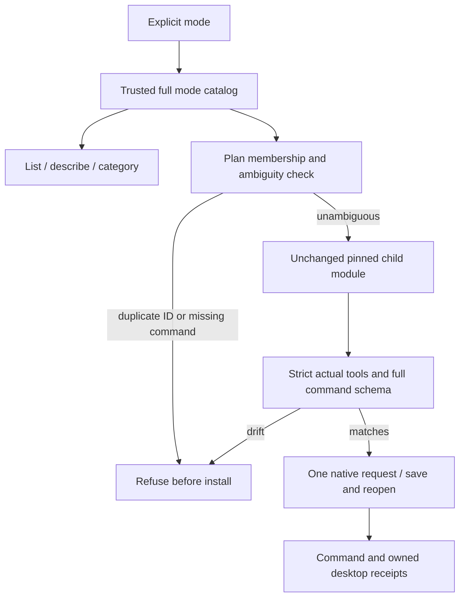

# ArtCraft mode command catalogs

Status: candidate implementation, partial acceptance (2026-10-09). OpenSpec AC-RT-002-MODE-CATALOG; tasks 4.6 and 4.19 remain open.

The fixed native headless and signed desktop catalogs differ. Art owns `mode-command-catalog.json`, binds its SHA-256 in the launcher and query helper, and binds each domain to its immutable bundle, native snapshot, desktop lock, native binary identity and signed app identity. No child source file is rewritten.

| Domain | Headless IDs | Desktop records / unique IDs | Candidate desktop workflow |
|---|---:|---:|---|
| FilmCraft | 666 | 666 / 666 | PASS, 5 operations |
| EffectCraft | 640 | 640 / 640 | PASS, 6 operations |
| PhotoCraft | 755 | 748 / 748 | PASS, 5 operations |
| VectorCraft | 585 | 763 / 762 | Refused: duplicate `file.place` descriptors |

Film desktop omits `frameRate` from `file.importImageSequence`. Photo desktop omits seven commands and changes two parameter descriptions. Vector desktop adds UI commands, omits the headless `file.export` alias, and repeats `file.place` with conflicting engine/UI descriptions. Counts must preserve raw records; converting to a dictionary loses this ambiguity.

The public query entry supports `list --domain photocraft --mode desktop --category paint`, `describe filmcraft file.importImageSequence --mode desktop`, and explicit `check` / `run` modes. Categories use command ID prefixes. Existing owner skills remain attached where available; additional UI records name `artcraft-cli`. Labels, parameter presence and full descriptions are retained. Dynamic enabled flags describe the observed empty session, not execution qualification. Historical `nativeUsage` fields from child coverage are provenance; use the Art mode-specific entry for actual mode routing.

The Art launcher selects the same full catalog for child validation and real MCP verification, intercepting only the trusted child module in memory. Effect bridge tools retain the child's separate identity validation. Receipts preserve the base child catalog identity and add the Art mode catalog identity. Unknown responses are never retried. Headless DAG execution retains its existing catalog and mode boundary.

Candidate desktop validation saved and reopened `.fcproj`, `.pcraft` and `.ecproj` with actual signed applications. Listener ownership and shutdown were verified. The JSON evidence records binary, plan and receipt digests. All three were revalidated against the final candidate guard. Mode-specific public structural checks pass for these domains; Vector is refused before installation. Fixed installation still requires a new immutable release.

Vector ambiguity is an open compatibility issue. The current implementation exposes all observed records for query, refuses ambiguous describe, and refuses desktop/bridge execution before installation. It does not silently choose a descriptor or weaken duplicate rejection. Further source-backed routing work and actual output qualification are required. No claim is made that every individual command has run.

Evidence: [candidate receipts](evidence/mode-command-candidate-20261009.json). Full V1 and host/permission acceptance remain open.
