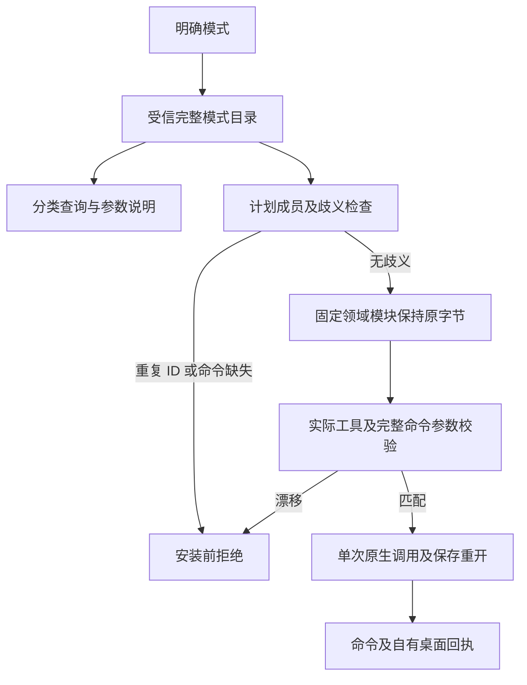

# ArtCraft 模式命令目录

状态：候选实现、部分验收（2026-10-09）。对应 OpenSpec AC-RT-002-MODE-CATALOG；4.6、4.19 保持开放。

固定原生 CLI 的 headless 目录与签名桌面目录存在差异。Art 自持 `mode-command-catalog.json`，启动器与查询助手固定其 SHA-256，各领域绑定不可变源包、原生快照、桌面锁、原生二进制与签名应用身份。领域源码文件保持原字节。

| 领域 | Headless ID | 桌面记录／不同 ID | 候选桌面流程 |
|---|---:|---:|---|
| FilmCraft | 666 | 666／666 | 通过，5 步 |
| EffectCraft | 640 | 640／640 | 通过，6 步 |
| PhotoCraft | 755 | 748／748 | 通过，5 步 |
| VectorCraft | 585 | 763／762 | 拒绝：`file.place` 参数描述重复冲突 |

Film 桌面的 `file.importImageSequence` 参数说明不含 `frameRate`；Photo 桌面缺少 7 条命令并有 2 条参数说明差异；Vector 桌面新增 UI 命令、缺少 headless 的 `file.export` 别名，且引擎／UI 的 `file.place` 描述重复冲突。必须保留原始记录数量，直接转换字典会掩盖歧义。

公开入口支持 `list --domain photocraft --mode desktop --category paint`、`describe filmcraft file.importImageSequence --mode desktop`，以及显式模式的 `check`／`run`。分类取 ID 前缀；已有命令保留领域 owner skill，新增 UI 记录指向 `artcraft-cli`；保留标签、参数字段是否存在及完整说明。空会话 enabled 状态仅为观察记录，逐命令运行验收保持 NOT_RUN。来自领域覆盖表的历史 `nativeUsage` 字段是来源信息，模式执行使用 Art 公开入口。

Art 启动器让领域预检和实际 MCP 校验使用同一完整目录，只在内存中适配受信模块。Effect bridge 附加工具保留领域自身独立身份校验。回执保留领域基础目录身份，并补充 Art 模式目录摘要。未知回复不重试。Headless DAG 继续使用原目录和模式边界。

实际签名桌面应用已保存并重新打开 `.fcproj`、`.pcraft`、`.ecproj`，验证监听归属及本次进程停止。JSON 证据记录二进制、计划和回执摘要。三个领域均已使用最终候选边界复验；对应公开模式结构检查通过，Vector在安装前拒绝。新版固定安装仍须独立发行复验。

Vector 歧义仍是兼容性未完成项。当前查询保留全部原始记录，歧义描述拒绝返回单条，desktop／bridge 执行在安装前拒绝；不静默挑选参数、不放松重复 ID 拒绝。后续须继续核实原生路由并验收实际产物，不能声称全部命令均已执行。

证据：[候选回执](evidence/mode-command-candidate-20261009.json)。完整 V1、宿主及权限验收仍未完成。
