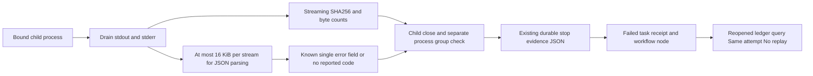

# ArtCraft Native Failure Diagnostics Architecture

Status: fixed runtime dev.32 / skills dev.28 / plugin dev.33, bounded installed-native verification passed. Specification authority: AC-TX-002-DIAG; scoped task 5.12 is verified. Previous runtime dev.28 lacked diagnostics. Full implementation and creative acceptance remain incomplete.

## Contract and ownership

The trusted execution worker observes stdout/stderr of the same native child that is bound to taskId, token, epoch and commandHash. It does not execute output content. A nonzero exit remains native_execution_failed. A recognized reported domainCode helps the user select a correction; it does not prove the physical cause or authorize replay.

## Bounded output and privacy

Each stream is hashed as raw observed bytes. The parser retains at most 16,384 bytes; when exceeded, the parse buffer is discarded while draining/hashing continues. Only a complete single JSON object with exactly the error string field may report one of the known workflow prefixes. Extra fields, unknown prefixes, non-JSON, oversized/incomplete streams and conflicting stdout/stderr codes do not produce a reported domain code. Raw output, private titles, font names and paths are never persisted by this collector.

Diagnostics schema craft-native-diagnostics/v1 contains domainCode, source and stdout/stderr {bytes,sha256,truncated,complete}. An empty stream has the normal empty SHA256. Digest refers to observed bytes; complete=false explicitly refuses a claim that the whole stream was collected. Existing spawn-error handling is unchanged and separate.

## Durable failure and compatibility

Stop evidence uses the existing executions.stop_evidence_json column. No SQLite schema bump or table migration is required; historical records without diagnostics remain readable. ExecutionRecord exposes optional diagnostics; failed task error attaches them only for native_execution_failed. Workflow nodes expose optional failure on the first result and on repeated queries. Cancellation and artifact-invalid errors retain their existing semantics. No diagnostic can release ownership without the existing confirmed-stop gate.

## Pipe inheritance and recovery

Pipes are continuously drained. After the primary child exit, a 250 ms drain window bounds inherited descriptors; remaining read streams are destroyed and marked incomplete. Process-group liveness is separately checked. A surviving descendant keeps the outcome unverified and the write lease retained. Worker or scheduler crash still follows the existing unknown-outcome rules. Query/reconcile does not spawn another native process.

## Evidence and remaining gate

Actual child-process tests cover known JSON failure, oversized and unknown text, reopened ledger, repeated recovery, privacy and inherited descriptors. DAG tests cover blocked consumers and repeated workflow failure. Previous runtime dev.28 demonstrated missing diagnostics. The strengthened native failure/status/repeat test passed on fixed installed plugin dev.33 with runtime dev.32. Unit/process tests do not substitute for cold public native installation or creative acceptance.

Fixed runtime dev.32 and source candidate dev.28 pass default online public PhotoCraft failure/status/repeat/revision/package testing. Reported protected_region_changed survives public queries with unchanged attemptId; installed-plugin verification remains pending.

Installed evidence: evidence/codex-release33-diagnostics-native-20261006.json; 58 skill hashes unchanged, diagnostic test 1 passed and four-domain first-use regression 3 passed.
