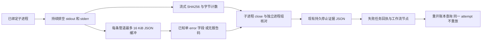

# ArtCraft 原生失败诊断架构

状态：固定运行时 dev.32／技能源 dev.28／插件 dev.33，有界安装后原生验证通过。规格事实源：AC-TX-002-DIAG；仅有界任务 5.12 已验收。旧运行时 dev.28 缺少诊断；完整实施与创作接受仍未完成。

## 合同与职责

可信监督 worker 观察同一个原生子进程的 stdout/stderr；任务身份、token、epoch、命令摘要仍由现有账本绑定。输出内容不能作为指令执行。非零退出仍返回 native_execution_failed；已识别的子任务报告错误码只帮助定位修正方向，不证明物理原因，也不授权重放。

## 有界输出与隐私

按实际观察的原始字节计算摘要。每条管道解析缓冲最多 16,384 字节；超限后丢弃解析缓冲，但继续排空并计算摘要。只有完整单个 JSON 对象、恰好一个 error 字符串字段且前缀属于支持的工作流错误码，才报告 domainCode。附加字段、未知前缀、非 JSON、超限／不完整输出，以及两条管道的冲突报告，均不能推断领域原因。该采集器不保存原始输出、私有标题、字体名称和路径。

craft-native-diagnostics/v1 包含 domainCode、source、stdout/stderr 的 bytes、sha256、truncated、complete。空输出使用空字节 SHA256；complete=false 明确表示摘要仅覆盖已观察数据。原有 spawn 错误处理保持独立。

## 持久化与兼容性

使用现有 executions.stop_evidence_json，无需升级 SQLite schema 或迁移表。历史停止记录无 diagnostics 时继续可读。ExecutionRecord 可选提供诊断；仅 native_execution_failed 的任务 error 附加诊断。首次结果和重复查询的工作流节点都可通过 failure 查看。取消和产物无效错误保持既有语义；诊断不能绕过确认停止门禁释放占用。

## 管道继承与恢复

持续消费输出管道；主子进程 exit 后等待 250 毫秒有界排空，仍由后代继承的管道随后关闭并标记不完整。进程组存活单独核对；后代尚存时保留不明确状态和写租约。监督 worker／调度器崩溃仍遵循现有恢复规则；查询与 reconcile 不创建新的原生进程。

## 证据与剩余门禁

真实子进程测试覆盖结构化失败、超限／未知文本、关闭重开账本、重复恢复、不保存原文及继承管道。DAG 测试覆盖阻断消费者与重复查询的失败信息。旧运行时 dev.28 的真实 PhotoCraft 失败用例先暴露诊断缺失；固定安装后插件 dev.33／运行时 dev.32 的增强失败／查询／重复执行测试现已通过。单元／进程测试不代替公开冷安装和创作验收。

固定运行时 dev.32 与源码候选 dev.28 已通过默认在线公开 PhotoCraft 失败／查询／重复执行／修订／打包测试。报告码 protected_region_changed 可公开查询，attemptId 保持不变；安装后插件复验仍待完成。

安装后证据：evidence/codex-release33-diagnostics-native-20261006.json；58 个技能摘要不变，诊断 1 项通过、四领域首次使用回归 3 项通过。
