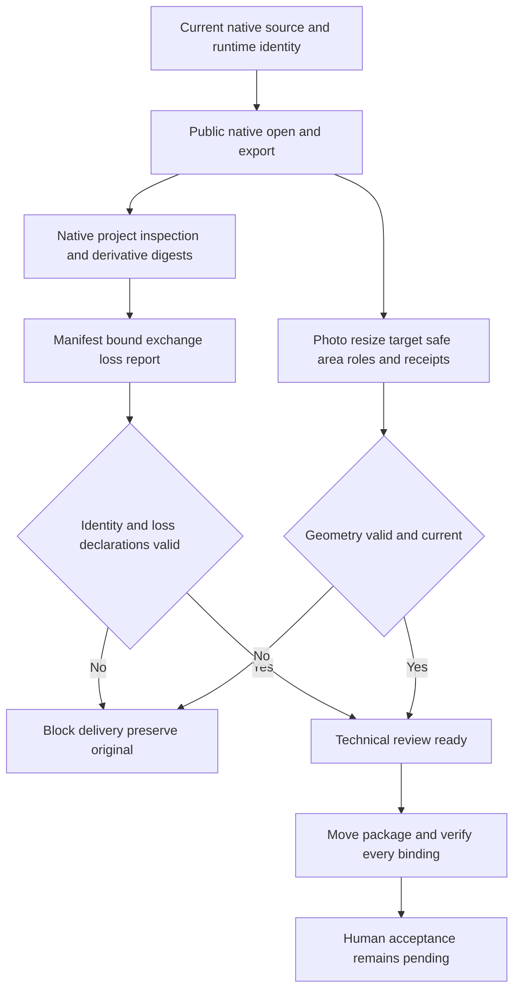

# ArtCraft Native Project and Exchange Loss Acceptance Architecture

> Scope: eight current AC-AR-002 scenarios and the historical SC-003 distribution milestone.
> Version: 1.0.0 · Updated: 2026-10-09

## 1. Decision and authority

All eight current scenarios pass on fixed plugin dev.127/source dev.99/runtime dev.126-runtime.1; task 7.6 is complete. The plugin establish-v1-plugin OpenSpec change remains authoritative; the skill repository mirrors evidence. Production skills and runtime bytes are unchanged. This update adds boundary regression, evidence and documentation.

Current domain pins Film38/Effect34/Photo34/Vector33 exceed historical SC-003's dev.27 target. Public tag commits, ZIP digests, ten distribution locks and 64 installed skill trees match. The historical milestone is complete; current pins remain intact without a downgrade.

## 2. Data and control flow

## 3. Observable scenario evidence

| Current scenario | Evidence |
|:---|:---|
| AC-AR-002-P | Five actual source projects across four domains reopen/export via public entries, preserve originals and verify in a moved package. |
| AC-AR-002-N | Editing losses remain lost and exports derivative; a hash-consistent nativeSubstitute=true fault is rejected before execution with zero budget allocation. |
| Bound native exchange loss report | Native, reopened inspection and each export bind hashes; lost/observed/unknown stay distinct. Three hash-consistent native/output/inspection identity faults are refused through the public entry. |
| Variant relocation | 320×400 source becomes 352×400; native layers, text, roles, safe area and resize receipts survive package relocation. |
| Altered packaged variant | Changed layout-variant.json is refused; restoring bytes verifies the same package. |
| Legacy cache missing geometry | Removing native-cache geometry blocks without replay; restoration reuses the same task/budget. A separate matching-outer-hash unit fixture without manifest binding verifies the specific missing gate. |
| Geometry before handoff | New/reused deliveries validate target, safe area, native roles/bounds and actual resize receipts; hash-consistent geometric forgeries are refused. |
| AC-AR-001-SEGMENT | A current fixed installed skill copied alone starts with an empty cache and public downloads: 1920×1080, 5 seconds, 120 frames, four segments. Per-frame RGBA/hashes, actual Film decoding/pixels, selective logo revision, independent reuse, corrupt-frame refusal/restoration and moved five-child package pass. |

[Complete evidence](evidence/native-loss-complete-fixed127-20261009.json) maps the exact eight scenarios and retains native/export/report hashes and test/log hashes. Actual HD first use: one passed in 264.591 seconds. Targeted regression: 13 passed. Runtime regression: 301 total, 280 passed and 21 conditional skips. All 64 installed host trees match after execution.

## 4. Evidence layers and failures

Source reopens and variant runs use the existing verified cache; the segmented HD run independently starts empty. The legacy missing-binding case is a protocol fixture and the native missing-file case an injected fault, not an old domain public release installation. The initial substitute assertion expected loss_report_invalid; actual correct refusal is protocol_invalid: $.outputs[0].nativeSubstitute. Its failure log is retained and the actual protocol checked without changing production behavior to fit the test.

Flattening/parameter losses remain lost, observed structure remains observed, and unverified fonts/cross-editor effect fidelity stays unknown. Technical readiness is neither lossless fidelity nor human acceptance. The HD sample does not establish arbitrary-duration performance, GUI or other-platform qualification.

## 5. Distribution milestone and remaining work

[SC-003 audit](evidence/sc003-distribution-fixed127-20261009.json) binds current public source tags/ZIPs, ten distribution locks, earlier source regression and ten public-source cold entries, plus current native cold workflow and host identity checks. It closes the historical upgrade milestone, not all-command execution, generic Skills CLI installation or full V1. Seventeen numbered tasks remain; unknown native interchange fidelity and human acceptance remain explicit.

---
Document version: 1.0.0 · Created/updated: 2026-10-09 · Status: verified for the bounded gate above.
