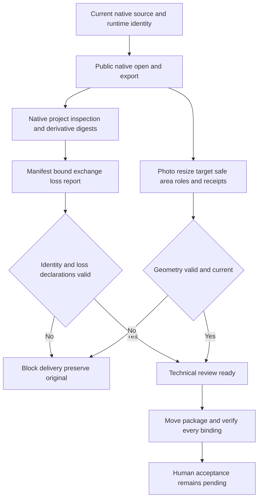

# ArtCraft 原生工程与交换损失验收架构

> **文档说明**：记录 AC-AR-002 的八个当前场景及历史分发里程碑 SC-003 的版本绑定验收。
> **版本**：V1.0.0
> **最后更新**：2026-10-09

## 1. 结论与事实源

固定插件 dev.127／技能源 dev.99／runtime dev.126-runtime.1 的八个当前场景验证完成，任务 7.6 完成。唯一行为规格事实源仍是插件 OpenSpec 的 establish-v1-plugin；技能仓镜像证据。生产技能和运行时字节保持不变，本次只增加边界回归、证据与文档。

当前四域依赖 Film38／Effect34／Photo34／Vector33 已超过历史 SC-003 的 dev.27 目标。公开标签提交、ZIP 摘要、十个分发锁和 64 项安装技能树均核对一致；历史里程碑已标记完成，保留当前固定依赖，不执行降级。

## 2. 数据与控制流

## 3. 场景与可观察证据

| 当前场景 | 证据 |
|:---|:---|
| AC-AR-002-P | 五份真实源工程覆盖四领域，公开入口重开、导出、打包、移动核验；原工程不变。 |
| AC-AR-002-N | 格式不可编辑能力声明 lost，导出为 derivative；摘要一致的 nativeSubstitute=true 故障夹具在执行前拒绝且零预算分配。 |
| 绑定原生工程的交换损失报告 | 原生、重开检查与每项导出摘要绑定；lost／observed／unknown 分开；原生身份、导出身份、检查身份三种摘要一致的篡改通过公开入口逐项拒绝。 |
| 变体记录随包迁移 | 320×400 源工程变为 352×400，保留原生图层、文字、角色、页边安全区和 resize 回执，移动后核验。 |
| 包内变体记录被修改 | 修改 layout-variant.json 后验包拒绝，恢复字节后同包通过。 |
| 旧缓存缺几何绑定 | 真实原生缓存注入缺失 manifest 几何绑定、匹配外层摘要的旧缓存形态，公开入口返回 photo_variant_evidence_missing；移走几何文件也阻断。恢复后复用相同任务及预算，不重跑；独立单元用例补充同一门禁。 |
| 交接前几何一致 | 新交付和复用均核验目标、安全区、原生角色／边界和实际 resize 回执；相关摘要一致的几何伪造测试拒绝。 |
| AC-AR-001-SEGMENT | 当前固定安装技能复制为单技能，空缓存公开下载后执行 1920×1080、5 秒、120 帧、4 段流程；逐帧 RGBA／摘要、实际 Film 解码与像素、Logo 关联返工、独立任务复用、坏帧拒绝／恢复及五子工程移动包通过。 |

[完整场景证据](evidence/native-loss-complete-fixed127-20261009.json) 精确对应当前八条场景；各子证据保留原生／导出／报告摘要、测试与日志摘要。HD 原生首用实际 1 项通过，用时 264.591 秒；目标回归 13 项通过；运行时回归 301 项中 280 通过、21 条件跳过。执行后 64 个安装技能树重新核验通过。

## 4. 证据层与失败说明

原生源重开和尺寸变体使用现有已验证缓存；分段 HD 首用独立空缓存，不混称两者。旧缓存缺绑定和缺文件均为真实原生缓存上的明确故障注入，另有独立协议夹具；不声称运行了某个旧领域公开发行。初次有损替代断言预期 loss_report_invalid，实际正确拒绝为 protocol_invalid: $.outputs[0].nativeSubstitute，首轮失败日志保留，随后按实际协议核验；未修改生产行为来迁就测试。

格式扁平化与参数损失保留 lost，已观察结构为 observed，未验证字体和跨编辑器效果保真保持 unknown。技术待审结果不构成无损承诺或人工接受；HD 样本不构成任意长片性能保证，也不覆盖 GUI 与其他平台。

## 5. 分发里程碑与剩余工作

[SC-003 审计](evidence/sc003-distribution-fixed127-20261009.json) 绑定四个现行公开源标签／ZIP、十个独立分发锁、先前源回归和十入口公开冷证据，以及本轮空缓存原生混合与安装身份核验。它关闭历史升级里程碑，不关闭逐命令执行、通用 Skills CLI 或完整 V1。现余 17 项编号任务；原生保真未知项与人工接受继续明确保留。

---

**文档版本**：V1.0.0
**创建日期**：2026-10-09
**最后更新**：2026-10-09
**文档状态**：已验证上述有限验收范围
