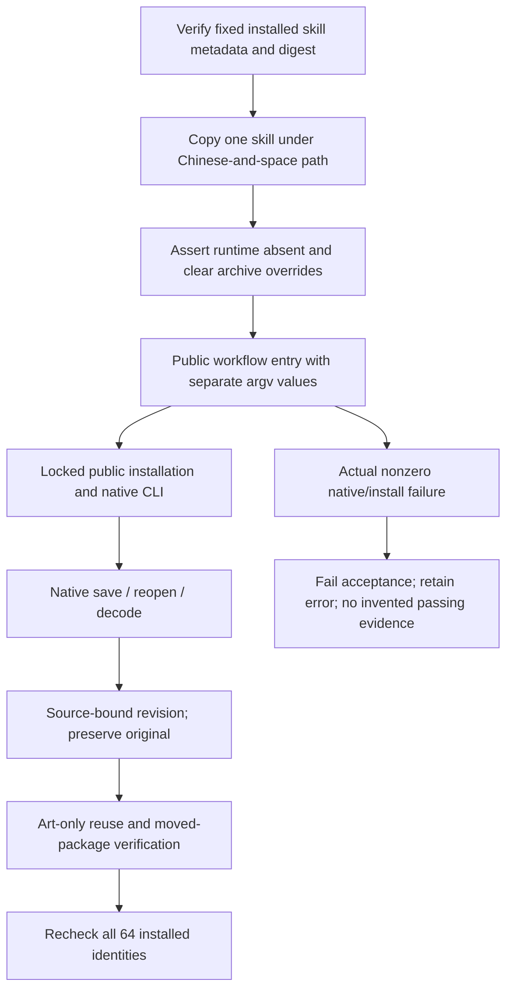

# First-use paths with Chinese characters and spaces

Five fixed installed use skills complete their existing native first-use tasks under `首次 使用 中文路径`. Each test copies only its selected installed skill and starts from an absent runtime. It uses default public downloads and removes inherited archive/cache overrides. Skill/runtime release identities remain unchanged; this change expands test drivers and records evidence.

## Identity and test scope

| Domain | Plugin | Independent source | Actual native verification |
| --- | --- | --- | --- |
| FilmCraft | dev.31 | dev.29 | Save/reopen `.fcproj`, PNG decode, source revision and original-file preservation |
| EffectCraft | dev.32 | dev.30 | Save/reopen `.ecproj`, PNG decode, source revision and original-file preservation |
| PhotoCraft | dev.32 | dev.30 | Save/reopen `.pcraft`, PNG decode, source revision and original-file preservation |
| VectorCraft | dev.31 | dev.29 | Save/reopen `.vectorcraft`, PNG decode, source revision and original-file preservation |
| ArtCraft | dev.101 | dev.75 | Four-domain native creation/revision/reuse, collected assets, output guards and moved-package verification |

Version prefixes are `0.1.0-`. Each of the five copied skills has its own fresh runtime; Art installs its pinned four-domain children. Standalone fixtures decode 32×32 PNG output; they do not establish movie encoding or every domain export format. The Art fixture separately verifies movie metadata, hash-bound source references and portable delivery. Original projects are retained after targeted revisions.

The common parent makes skill scripts, runtime executables, input files, project roots, saved outputs and moved packages exercise the same Chinese-and-space path boundary. It does not establish every Unicode normalization, reserved-name or filesystem combination. This is macOS arm64 with Python 3.13.5, not cross-platform proof.

## Public entry and failure boundary

The tests pass paths as separate argv values. They exercise path transport through public scripts and native tools; they do not claim a new literal Bash README-snippet test. User shell examples still quote the actual `SKILL_DIR`; no guessed mount directory is introduced.

Four standalone drivers use `CRAFT_NATIVE_WORKFLOW_FIRST_USE=1`, `CRAFT_INSTALLED_NATIVE_WORKFLOW_SKILL`, `CRAFT_NATIVE_WORKFLOW_REPORT` and `CRAFT_UNICODE_PATH_FIRST_USE=1`. Art uses its existing `CRAFT_LIVE_TEST=1`, `CRAFT_ONLINE_FIRST_USE=1`, `CRAFT_INSTALLED_SKILL_ROOT`, `CRAFT_WORKFLOW_EVIDENCE_FILE` plus the same path flag. Run the corresponding `test_native_workflow_first_use.py` or `test_workflow_first_use.py` with isolated Python. Flags enable explicit native acceptance; default unit suites skip these tests and cannot substitute for the live result.

The fixed evidence is `docs/evidence/craft-fixed-unicode-path-first-use-20261007.json`. It binds the full host release lock, copied skill hashes, driver hashes, native artifact hashes and all64 post-run metadata/tree checks. Driver edits do not change vendored skills, native runtime archives or immutable tags. Complete OpenSpec contracts remain open until their full scenarios are established; no task is closed by this bounded result.

Actual generic Skills CLI installation, model/GUI use, all2,646 command contexts, all439 formal scenarios, creative acceptance, other platforms and production remain outside this result.
