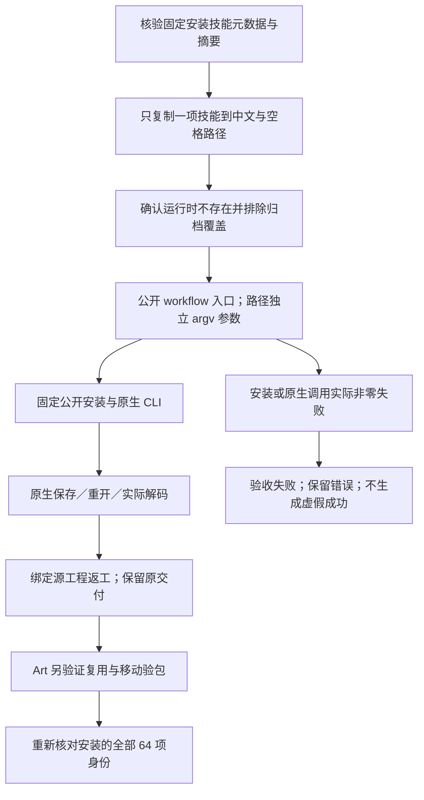

# 含中文和空格路径的首次使用

五个固定安装的 use 技能在 `首次 使用 中文路径` 下完成现有真实首次使用任务。每项只复制当前安装的一项技能，从不存在的运行时开始，走默认公开下载，排除继承的离线归档和缓存覆盖。本次仅扩展测试驱动和验收证据，技能及运行时发行身份保持不变。

## 身份与验证范围

| 领域 | 插件 | 独立技能源 | 实际原生验证 |
| --- | --- | --- | --- |
| FilmCraft | dev.31 | dev.29 | `.fcproj` 保存重开、PNG 解码、源返工及原文件保全 |
| EffectCraft | dev.32 | dev.30 | `.ecproj` 保存重开、PNG 解码、源返工及原文件保全 |
| PhotoCraft | dev.32 | dev.30 | `.pcraft` 保存重开、PNG 解码、源返工及原文件保全 |
| VectorCraft | dev.31 | dev.29 | `.vectorcraft` 保存重开、PNG 解码、源返工及原文件保全 |
| ArtCraft | dev.101 | dev.75 | 四领域原生创建、返工及复用；收集素材、执行登记及移动验包 |

版本前缀均为 `0.1.0-`。五项复制的技能各用一个独立新运行时；Art 安装固定四领域子技能。独立领域示例实际解码 32×32 PNG，不由此推断视频编码或所有导出格式；Art 示例另核验成片属性、摘要绑定素材及可移动交付。定点返工后原工程保留。

共同父目录使技能脚本、运行时可执行文件、输入素材、工程根目录、保存产物和移动包均实际经过中文与空格路径。该结果不推广为所有 Unicode 规范化、保留文件名或文件系统组合的验收。平台是 macOS arm64、Python 3.13.5，不代表其他平台。

## 公开入口与失败边界

驱动将路径作为独立 argv 参数传递，验证公开脚本到原生工具的路径链路，不声称新增逐字执行 Bash README 命令块。用户 shell 示例仍需为实际 `SKILL_DIR` 加引号，不引入猜测的挂载目录。

独立领域驱动使用 `CRAFT_NATIVE_WORKFLOW_FIRST_USE=1`、`CRAFT_INSTALLED_NATIVE_WORKFLOW_SKILL`、`CRAFT_NATIVE_WORKFLOW_REPORT` 和 `CRAFT_UNICODE_PATH_FIRST_USE=1`。Art 使用现有 `CRAFT_LIVE_TEST=1`、`CRAFT_ONLINE_FIRST_USE=1`、`CRAFT_INSTALLED_SKILL_ROOT`、`CRAFT_WORKFLOW_EVIDENCE_FILE`，另启用相同路径标志。用隔离 Python 执行对应 `test_native_workflow_first_use.py` 或 `test_workflow_first_use.py`。这些标志明确启用原生验收；默认单元套件跳过原生用例，不能替代本次实际运行。

固定证据位于 `docs/evidence/craft-fixed-unicode-path-first-use-20261007.json`，绑定完整宿主发行锁、复制技能摘要、驱动摘要、原生产物摘要，以及执行后全部 64 个安装技能的元数据和目录检查。驱动修改不改变插件收录的技能、运行时归档或不可变标签。完整 OpenSpec 合同仍需逐场景审阅，不因本次局部证据关闭任务。

实际通用 Skills CLI 安装、模型／GUI 使用、全部 2,646 命令上下文、439 个规范场景、创作接受、其他平台及生产验证均不属于本次结果。
