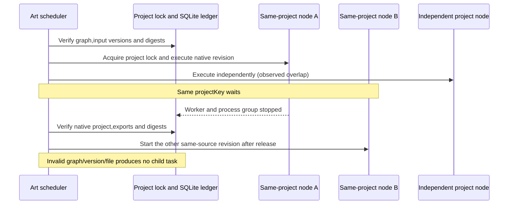

# ArtCraft Native Scheduling Acceptance Architecture

Task6.9 passes the three AC-DM-003 scenarios on fixed Art126/source98/runtime126.[Bound evidence](evidence/native-scheduling-fixed126-20261008.json).This document serves scheduler,skill and acceptance maintainers.Full V1 still has31 open numbered tasks.

The scheduler isolates writes by logical projectKey.Domain adapters verify immutable source deliveries and edit copies in task-specific directories.Two branches from the same source therefore preserve the original and their separate results while sharing a logical project write lock.This contract does not require in-place mutation of source files or treat parallel source reads as conflicting writes.

| Scenario | Actual evidence |
| :--- | :--- |
| AC-DM-003-P | Four fixed native sources;eight native revisions;independent native worker intervals overlap.Every baseline DAG dependency starts after parent verification,with matching source reference versions and digests. |
| AC-DM-003-N | Each domain has two nodes sharing a source digest and projectKey.A completes verification before B starts.Cycles,missing parents,contradictory immutable-version digests and damaged input bytes all refuse with zero tasks,execution records and leases. |
| AC-DM-003-IDENTITY | Existing fixed126 native opaque-ID four-domain creation,JSON receipt,restart reuse and moved-package evidence is retained;baseline ledger,old deliveries,33 runtime files and64 installed skill trees are rechecked. |

Intervals use trusted supervisor records of actual PIDs,spawn,close,process-group stop and review_ready event ordering.No sleeps,injected executors or fabricated CLI results were used.Repeats preserve the entire event list,task IDs and budget.All four original source trees retain their file digests.Saved native dimensions match the requested revisions.Initial fixture failures misunderstood absent inputBindings defaults and an earlier immutable-version rejection;raw logs are retained and do not count as product RED or acceptance PASS.

This uses verified fixed installed skills and warm native caches.The prior fixed evidence separately proves10 independent cold starts and64 CLI probes.Parallelism is measured for native workflow workers,not every nested CLI subcall.The31 other tasks,generic Skills CLI installation,GUI,model dispatch,human creative approval and full V1 retain their own gates.The previous whole-workspace source audit refused because other domain worktrees differ from fixed refs;fixed releases and actual installed trees are checked separately.

Only acceptance tests and documentation changed;production skill/runtime bytes remain unchanged.Published126/98 are retained without duplicate releases.
