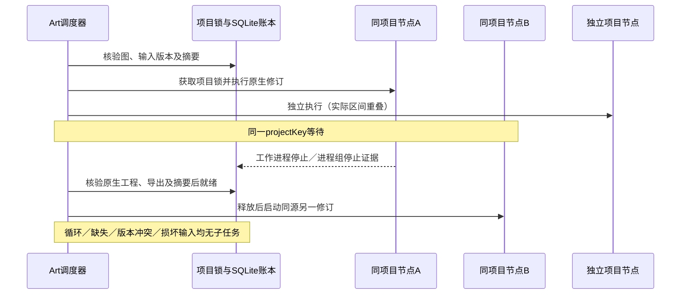

# ArtCraft 原生调度验收架构

任务6.9已完成固定Art126／源98／runtime126的AC-DM-003三场景验收。[绑定证据](evidence/native-scheduling-fixed126-20261008.json)。本文面向调度器、技能和验收维护者；完整V1仍有31项编号任务开放。

系统按逻辑projectKey隔离写入；领域适配器核验不可变源交付后在任务专属目录中修改复制工程。因此，同源双分支可以保留原交付及各自结果，同时共享逻辑项目的写入锁。验收不要求对源文件原地写入，也不把并行读取源文件当作冲突写入。

| 场景 | 当前实际证据 |
| :--- | :--- |
| AC-DM-003-P | 四领域固定原生源工程；八个真实源修订；独立原生工作进程存在重叠区间；基线DAG的每条依赖均在父产物核验之后启动，源引用摘要／版本一致。 |
| AC-DM-003-N | 四领域分别使用相同源工程摘要和相同projectKey的双节点；A完成技术核验之后B才启动。循环、缺失父节点、同一不可变版本摘要矛盾和实际文件损坏四类均拒绝，任务／执行记录／租约为零。 |
| AC-DM-003-IDENTITY | 复用已固定126的真实特殊ID四领域创建、JSON回执、重启复用和移动包证据；重新检查基线账本、旧交付、33项运行时文件及64项宿主技能。 |

执行区间来自受信监督器登记的真实PID、spawn、close、进程组停止及review_ready事件顺序。没有注入睡眠、替换执行器或伪造CLI。重复执行的完整事件列表、任务ID和预算保持相同，原始四份源交付逐文件摘要保持不变。尺寸修改的实际重开结果也与请求一致。首次两次夹具失败分别来自未声明inputBindings的默认语义理解错误、版本矛盾被更早拒绝；原始日志保留，不充作产品红灯或通过证据。

验收使用已核验的固定安装技能和暖原生缓存；十项独立冷启动及64项CLI探测由前置固定证据单独证明。并行范围为原生工作进程，不宣称逐个嵌套CLI调用都重叠。31项其他任务、通用Skills CLI实际安装、GUI、模型调度、人工创作接受和完整V1保持各自门禁。此前全工作区来源审计因其他领域工作树偏离固定引用而拒绝，不能改称通过；固定发行与实际安装树单独核验。

本次新增验收测试与文档，生产技能和运行时字节未变，沿用已发布126／98，不创建重复发行。
