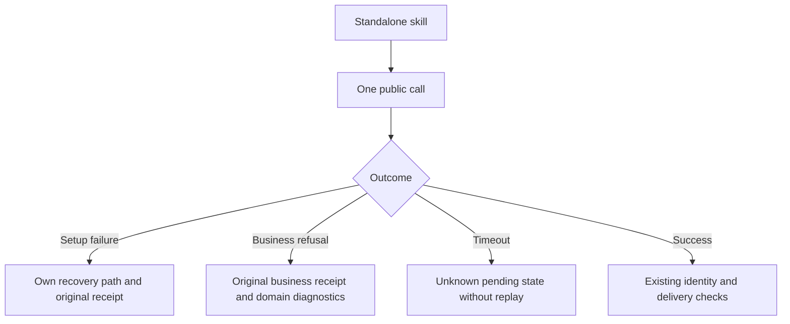

# ArtCraft nested-call diagnostics and domain handoff

Contract: OpenSpec AC-SK-003-NESTED-SETUP, task3.30. This is source-candidate evidence; immutable release and installed-host qualification remain required before closing the task.

Review, bounded revision and domain-command entries call their next public entry through their own `public_call.py`. Each call runs once; installer waits are bounded to600 seconds. Structured refusals retain `publicCallReceipt`; installation failures additionally retain `installationReceipt` and a recovery path derived only from the current skill. Returned foreign paths are not trusted. Timeouts remain unknown; pending revision identity and budgets are preserved, with the existing explicit resume contract.

Pinned check parsers differ: Film38, Photo34 and Vector33 do not accept `--mode` for `commands.py check`; Effect34 does, with desktop mapped to bridge. Art forwards the check mode only to Effect. Existing execution-mode handoff is unchanged. Nonzero, non-JSON and non-PASS check replies are refused while retaining returncode and at most64KiB of stdout/stderr. A structural check still reports nativeExecution=NOT_RUN and does not establish native execution.

Source regression:174 tests,136 passed,38 conditional skips. Thirty real nested setup refusals across ten individually copied skills pass. A real single-skill public cold recovery creates a native Vector project and96×64 preview, a workflow, a delivery package and a relocated review verification. Separate native review and revision role cases pass. Review remains pending; creative and human acceptance are NOT_RUN. These results do not qualify a new immutable release, generic Skills CLI installation or complete V1.
