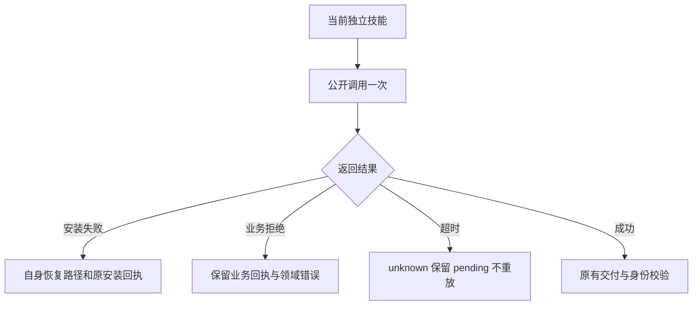

# ArtCraft 嵌套调用诊断与领域交接

对应 OpenSpec AC-SK-003-NESTED-SETUP、任务3.30。当前为源码候选；固定发行与安装宿主复验完成前，任务保持开放。

审阅、受限返工、领域命令三个入口通过自身 `public_call.py` 调用下一层公开入口。每次仅调用一次，安装调用最多等待600秒。结构化拒绝保留 `publicCallReceipt`；安装错误另保留 `installationReceipt`，恢复位置由当前技能自身确定，忽略返回回执中提供的其他路径。超时保留 unknown，已进入返工的 pending 身份与额度不变；恢复必须遵守原显式 resume 契约。

固定领域依赖的检查入口并不相同：Film38、Photo34、Vector33的 `commands.py check` 不接受 `--mode`；Effect34接受该参数，desktop检查映射为bridge。Art仅对Effect传递检查模式；运行模式交接保持既有契约。领域检查非零退出、非JSON或非PASS结果均拒绝，并保留最多64KiB的stdout/stderr和退出码。目录与结构检查成功仍只表示 nativeExecution=NOT_RUN，不能替代实际执行。

本次源码174项测试：136通过、38条件跳过。十个单独复制技能的30条真实嵌套安装拒绝通过。单技能真实公开冷恢复完成原生Vector工程和96×64预览、工作流、打包及移动审阅核验；审阅与返工的原生角色用例另行通过。审阅决定仍pending，创意与人工验收NOT_RUN。固定版、通用Skills CLI实际安装、完整V1均未由这些结果证明。
