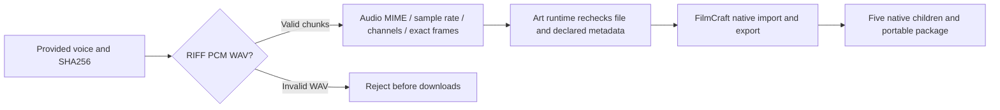

# ArtCraft PCM WAV Asset Architecture

## Authority and verified gap

OpenSpec AC-CP-002-WAV and task 2.4 own this increment. Previously provided narration was registered as application/octet-stream with no audio metadata; the public artifact verifier rejected audio/wav. A false .wav file reached runtime setup. New tests reproduced both gaps before implementation. This affects the actual first-use input asset contract, independently of FilmCraft native audio/export checks.

## Data contract and implementation

The skill reads chunk headers with a bounded fmt allocation and skips sample data; existing streaming SHA256 remains authoritative. A WAV file identified by content records sampleRate/channels/bitDepth, decimal durationTicks equal to PCM frames, and timeBase 1/sampleRate. The public verifier streams the entire file for bytes and SHA256, inspects RIFF length, fmt/data uniqueness/order, chunk padding and bounds, PCM frame alignment, byte rate and block alignment, then checks declared audio facts and any exact rational duration. File identity is checked around inspection. The original asset is never edited or transcoded.

Standard little-endian RIFF WAVE_FORMAT_PCM (tag 1), 8/16/24/32-bit samples are recognized. Unknown non-WAV inputs retain their previous generic binary representation without claiming media identification. A false .wav extension fails before installation. Non-PCM/compressed WAV, extensible formats and RF64 remain outside this increment and report an explicit boundary. Container verification does not prove audible speech quality; FilmCraft still performs actual native audio and media export checks.

Chunk traversal follows [Microsoft RIFF documentation](https://learn.microsoft.com/en-us/windows/win32/xaudio2/resource-interchange-file-format--riff-). No new dependency or global runtime is required; the source script stays self-contained, and runtime dev.54 includes its own bounded WAV inspection module.

## Evidence and distribution

13 protocol tests and two source WAV tests pass after expected failures. The runtime regression runs 148 tests: 142 pass, six explicit native gates skipped; source regression runs 88: 68 pass, twenty live gates skipped. Candidate five-child cold native delivery and moved-package verification are being exercised; immutable publication and installed default-public verification remain pending. [Repair evidence](evidence/pcm-wav-repair-20261006.json). Task 2.4 remains open. ArtCraft does not adapt Jianying. Earlier published dev.53 retains its own verified scope.

## Fixed installed acceptance

Plugin dev.55 / independent source dev.39 / runtime dev.54 installs alongside Film dev.9, Effect dev.8, Photo dev.9 and Vector dev.10 in isolated Codex 0.153.4: 58 skills discovered, zero errors. Installed execute copied alone uses default public downloads, registers a 48 kHz mono 16-bit PCM input by content even with a .bin name, creates five native children and verifies a moved delivery package (53.972s). All ten Art skills independently cold-install runtime dev.54 (111.799s); all 58 original installed skill digests remain unchanged. Five locked bundles reproduce from immutable tags. Final runtime regression: 143 pass, six explicit native skips; source: 68 pass, twenty live skips. [Version-bound evidence](evidence/codex-release55-pcm-wav-first-use-20261006.json). Only task 2.4 closes. Earlier pending statements describe candidate/publication stages; complete V1, generic Skills CLI, model/GUI and creative acceptance remain open. No broader WAV codec or native bit-depth acceptance is implied.
