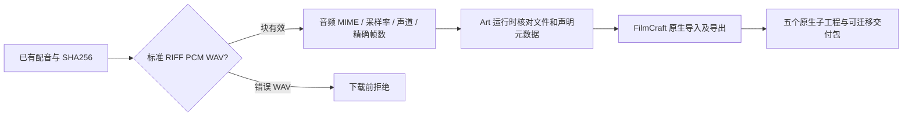

# ArtCraft PCM WAV 素材架构

## 事实源与已复现缺口

OpenSpec AC-CP-002-WAV 与任务 2.4 管理本增量。此前已有配音被登记为无音频元数据的 application/octet-stream，公共素材校验器拒绝 audio/wav；假 .wav 文件也会进入安装流程。新增测试先复现这两个缺口。该问题属于首次使用的输入素材合同，与 FilmCraft 原生音频及导出检查分别验证。

## 数据合同与实现

技能只读取块头，以有界 fmt 缓冲处理格式块，跳过采样数据；已有流式 SHA256 保持素材内容事实源。按内容识别 WAV 后记录 sampleRate／channels／bitDepth、以 PCM 样本帧为单位的十进制 durationTicks 与 timeBase=1/sampleRate。公共校验器流式核对完整文件字节及摘要，再检查 RIFF 长度、fmt／data 的唯一性和顺序、块填充与边界、PCM 帧对齐、字节率和块对齐，并核对声明音频属性及适用的精确有理数时长。检查前后核对文件身份；不修改或转码原配音。

识别小端 RIFF WAVE_FORMAT_PCM（tag 1）、8／16／24／32 位采样。未知非 WAV 输入保持既有二进制表示，不声称已识别媒体；假 .wav 后缀文件在安装前失败。非 PCM／压缩 WAV、扩展格式及 RF64 不在本增量范围，明确报告格式边界。容器核验不证明语音听感，FilmCraft 原生音频和成片解码门禁仍独立执行。

块遍历依据 [Microsoft RIFF 文档](https://learn.microsoft.com/en-us/windows/win32/xaudio2/resource-interchange-file-format--riff-)。不增加外部依赖或全局运行时；独立技能脚本自包含，runtime dev.54 自带有界 WAV 检查模块。

## 证据与分发

预期失败后，13 项协议测试与两项技能 WAV 测试通过；全运行时 148 项中 142 通过、六项显式原生可选跳过；技能源 88 项中 68 通过、二十项真实场景跳过。候选五子工程冷启动与迁移验包正在执行，不可变发布及安装后的默认公开首次使用仍待完成。[修复证据](evidence/pcm-wav-repair-20261006.json)。2.4 保持开放，ArtCraft 不适配剪映；此前 dev.53 保持其原验收范围。

## 固定安装验收

插件 dev.55／独立技能源 dev.39／runtime dev.54 与 Film dev.9、Effect dev.8、Photo dev.9、Vector dev.10 在 Codex 0.153.4 隔离安装：58 技能发现、零错误。安装后 execute 单独复制，默认公开下载后按内容识别具有 .bin 名称的 48 kHz 单声道 16 位 PCM 输入，创建五个原生子工程，移动交付包后验包通过（53.972 秒）。十项 Art 技能分别从空运行时安装 dev.54（111.799 秒），原安装 58 项技能摘要不变；五个锁定包从固定标签重建一致。最终运行时 143 通过、六项显式原生跳过；源码 68 通过、二十项真实场景跳过。[版本绑定证据](evidence/codex-release55-pcm-wav-first-use-20261006.json)。仅关闭 2.4，前文待验状态保留候选及发布阶段的历史范围；完整首版、通用 Skills CLI、模型／GUI 与创作验收仍开放。不推断其他 WAV 编码或原生位深已验收。
