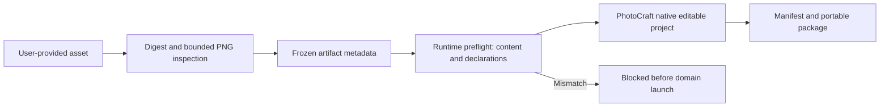

# ArtCraft PNG asset registration and verification

## Status and scope

Runtime dev.56 is published from its immutable tag; source dev.40 is being fixed for plugin dev.57. Installed-host verification remains pending. Historical dev.55/dev.39/dev.54 and candidate evidence keep their original scope. Independent skill registration and runtime verification have separate tests; a candidate skill using baseline public downloads does not establish publication of the candidate runtime.

## Contract

The entry point recognizes static PNG by content, even with a `.bin` filename. It records actual width, height, bitDepth and alpha representation. Alpha means an alpha channel or tRNS chunk; it does not assert visually transparent pixels, correct ICC conversion or creative acceptance. Unknown formats retain the existing generic-binary behavior; a false `.png` fails before bootstrap.

## Implementation and limits

Python uses only the standard library. Each independently installed skill carries png_inspection.py. The Node runtime has its own verifier, not a Python-module import. Both inspect chunk bounds and CRC, legal IHDR fields, palette/transparency ordering, consecutive IDAT chunks, final IEND, bounded zlib expansion and scanline filter bytes. Standard legal color types and depths and Adam7 scan layout are supported. APNG is explicitly unsupported. Limits are 64 MiB input and 128 MiB inflated scan data. PNG metadata present in an artifact must match the content; historical derivatives lacking those declarations still receive content verification.

The verifier checks filtered scan data; it does not reconstruct every pixel, evaluate palette indices, color-transform or compare rendered appearance. Native import and independent image decoding are separate evidence. Source files and skill installation files must remain unchanged. There is no transcoding or silent substitute image.

## Verification and remaining work

Tests cover signature versus extension, palette transparency, all standard depth/color combinations, Adam7, truncation, corrupt CRC, malformed scan data, false declarations and zero domain launches after preflight rejection. A real four-domain native test covers generated PNG handoff and Logo revision. A separate isolated candidate skill uses existing public downloads for PNG registration, Photo native delivery and moved-package verification.

Fixed candidate publication, installed-host repetition, JPEG/video identification and complete creative/GUI acceptance remain open. OpenSpec scenario AC-CP-002-PNG is the behavioral authority; the change remains active.

[Candidate evidence / 候选证据](evidence/png-candidate-20261006.json)
