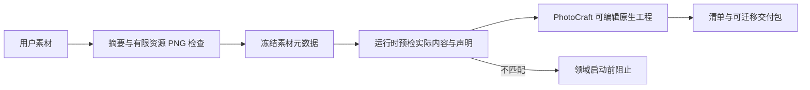

# ArtCraft PNG 素材登记与核验架构

## 状态与范围

运行时 dev.56 已由不可变标签发布；技能源 dev.40 正在固定供插件 dev.57 使用，安装后宿主复验待执行。历史 dev.55／dev.39／dev.54 与候选证据保持原范围。独立技能登记与运行时核验分别测试。候选技能调用既有公开下载，不证明候选运行时已经发布。

## 合同

入口按内容识别静态 PNG，允许 `.bin` 文件名，登记实际 width、height、bitDepth、alpha。Alpha 仅表示通道或 tRNS，不证明像素实际透明、ICC 转换正确或创作通过。未知格式保持通用二进制行为，假 `.png` 在安装前拒绝。

## 实现与边界

Python 仅用标准库，每个独立技能携带 png_inspection.py；Node 运行时独立核验，不导入 Python 内部模块。两端检查块边界及 CRC、合法 IHDR、调色板／透明块顺序、连续 IDAT、末尾 IEND、有限 zlib 解压和扫描行过滤字节。支持标准颜色类型、合法位深和 Adam7 扫描布局；明确拒绝 APNG。输入上限 64 MiB，解压扫描数据上限 128 MiB。产物声明 PNG 属性时逐项匹配；历史派生物没有声明时仍检查内容。

检查覆盖过滤后的扫描数据，不逐像素重建、不检查调色板索引、不执行颜色转换或视觉对比。原生导入和独立图像解码属于单独证据。源素材及技能安装文件保持不变，不转码、不生成替代图片。

## 验证与未完成内容

测试覆盖内容签名与扩展名、调色板透明度、所有标准位深／颜色组合、Adam7、截断、CRC 损坏、错误扫描数据、错误属性声明与预检失败后的零领域启动。真实四领域原生测试覆盖 PNG 交接及 Logo 修订；另有候选单技能通过既有公开下载登记 PNG、生成 Photo 原生交付并迁移验包。

固定候选发布、安装宿主复验、JPEG／视频识别以及完整创作／GUI 验收仍开放。OpenSpec AC-CP-002-PNG 为行为事实源，现有变更保持进行中。

[Candidate evidence / 候选证据](evidence/png-candidate-20261006.json)
