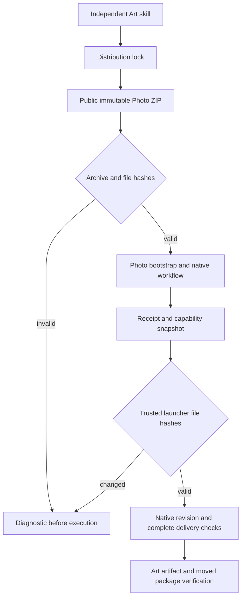

# ArtCraft Photo delivery dependency architecture

> Status: fixed installed dependency acceptance passed; full V1 remains open. Updated: 2026-10-08.

## 1. Scope and authority

Ten independent Art skills pin Photo source `0.1.0-dev.34`. The orchestration runtime stays `0.1.0-dev.113-runtime.1`; Film36, Effect34 and Vector31 remain unchanged. OpenSpec `establish-v1-plugin` in the plugin repository remains the behavior authority. This document records an incremental dependency and installer change, not a completed V1.

## 2. Installation and execution

The published ZIP has prefix `photocraft-skills-0.1.0-dev.34/`. Rebuilding it with a different prefix changes its digest. The installer therefore accepts only the exact repository prefix or repository plus exact locked version; a versioned prefix also requires a matching release URL tag. Archive size, complete file hashes, path escape and symlink rejection remain enforced. The bundle builder supports the same two layouts.

`delivery.py` is included in the receipt file list and capability snapshot when present. Trusted launch verification can detect changes after installation. Older domains without this optional helper retain their existing file identities; the native CLI is unchanged.

## 3. Immutable inputs

Photo source commit: `c3b23207b6a6f09032c9dd0a68c7b173a36b11c0`. ZIP SHA256: `9773df829a565a6ee79d302fbb1a74310a02039b1bf94f5666a46fe83c5cb55c`; bytes: 3941901. The distribution lock carries all root-relative file hashes. Whole-bundle identity is distinct from individual launcher file identity. Neither proves creative approval or external authorship.

## 4. Verification and failure recovery

Prefix tests first failed with the real versioned layout, then passed after the restricted compatibility fix. The receipt test first failed because `delivery.py` was absent and passed after identity binding. Full source regression: 156 tests, 118 passed, 38 opt-in tests skipped. The native candidate copies only one skill into a temporary `.agents/skills`, uses an empty runtime and public downloads, saves/revises an adjustment mask, preserves control pixels and other layers, and verifies a moved package. See [candidate evidence](evidence/art-photo34-dependency-candidate-20261008.json).

Invalid layouts fail before install. Changed helper identity requires restoring the pinned bundle rather than updating the receipt to accept a modified file. No old release/tag is replaced. Source86 and plugin114 are now published. All ten Art skills pass independent cold installation; 54 byte-identical skills retain their version-bound historical cold proof. Actual installed114 passes four-domain creation, native source revisions, relocated package verification, and original/revised Photo delivery integrity; 64 installed whole-tree hashes are rechecked. Native projects and valid moved packages are retained. Four immutable plugin CI runs succeed. [Fixed evidence](evidence/craft-art-photo34-fixed-first-use-20261008.json).

## 5. Limits

The native sample does not prove exhaustive command execution, PSD fidelity, GUI operation, complete immutable logical lineage or full V1. The earlier adjustment candidate cleans its temporary projects. The fixed mixed test uses CRAFT_MIXED_RETAINED_OUTPUT, refuses an existing output directory, restores the intentionally tampered layout, and retains usable native originals, revisions and moved packages. Downloaded negative-test runtimes may be removed only after terminal execution, file hash inventory and a fresh no-open-file check; project files are preserved. Report hashes alone are not editable deliverables. Generic Skills CLI installation remains a separate open gate.
