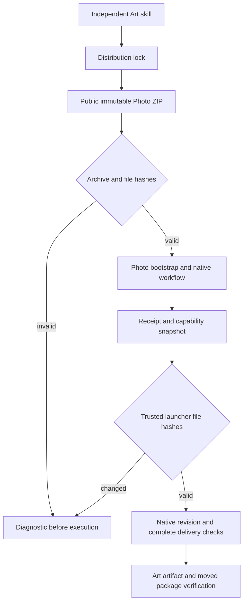

# ArtCraft Photo 交付依赖架构

> 状态：固定安装依赖验收通过，完整首版仍未完成。更新：2026-10-08。

## 1. 范围与事实源

10 个独立 Art 技能固定 Photo 技能源 `0.1.0-dev.34`。编排运行时保持 `0.1.0-dev.113-runtime.1`，Film36、Effect34、Vector31 不变。行为事实源仍为插件仓库 OpenSpec `establish-v1-plugin`。本次是依赖与安装器增量变更，不能据此宣称完整首版交付。

## 2. 安装与执行

公开 ZIP 的真实前缀为 `photocraft-skills-0.1.0-dev.34/`，更换前缀会改变摘要。因此安装器仅接受精确仓库名前缀或仓库名加锁定版本前缀，后者还要求发布 URL 标签匹配。完整压缩包和逐文件摘要、大小、越界路径及符号链接拒绝规则继续执行。构建器支持相同的两种布局。

存在 `delivery.py` 时，将其纳入安装回执文件列表和能力快照，可信启动器可检测安装后的变化。没有此可选助手的旧领域继续使用原身份，原生 CLI 不变。

## 3. 固定输入

Photo 源码提交：`c3b23207b6a6f09032c9dd0a68c7b173a36b11c0`。ZIP SHA256：`9773df829a565a6ee79d302fbb1a74310a02039b1bf94f5666a46fe83c5cb55c`。分发锁保存全部相对根路径文件摘要。整个技能包身份与执行文件身份分别校验，均不能证明创作验收或外部作者身份。

## 4. 验证与恢复

真实版本前缀兼容测试先失败，再修复为通过。回执测试先因缺少 `delivery.py` 失败，再补齐身份后通过。完整源回归共 156 项，118 通过、38 个显式启用的测试跳过。原生候选测试只复制一个技能到临时 `.agents/skills`，空运行时通过公开下载安装，保存并返工蒙版调整，保留对照像素和其他图层，校验移动后的包。参见[候选证据](evidence/art-photo34-dependency-candidate-20261008.json)。

无效布局安装前拒绝。执行助手身份变化后，应恢复锁定包，不能改写回执使变化合法化。不替换已有发布或标签。源86与插件114现已发布。10 个 Art 技能逐一独立冷安装通过；54 个完整摘要一致的技能复用其原有版本绑定冷证据。实际安装114通过四域创建、原生源工程返工、移动包及 Photo 原始／返工交付完整性检查；执行后重算64个安装技能完整摘要。原生工程及有效移动包已保留，固定提交4项CI成功。[固定证据](evidence/craft-art-photo34-fixed-first-use-20261008.json)。

## 5. 验证边界

原生样本不证明全部命令、PSD 保真、GUI、完整逻辑谱系或完整首版。此前调整候选测试清理临时工程；固定混合测试使用 CRAFT_MIXED_RETAINED_OUTPUT，拒绝已有输出目录，恢复故意篡改的布局后，保留可用的原生原件、修订件和移动包。负例下载运行时仅在执行终止、保存文件摘要清单及重新确认无打开文件后清理，工程继续保留。报告摘要不能代替可编辑交付物。通用 Skills CLI 安装仍为独立未完成门禁。
