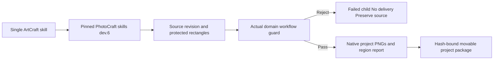

# ArtCraft PhotoCraft Protection Handoff Architecture

Status: fixed skills dev.26 and plugin dev.30 pass independent online and installed-host integration. Runtime stays at dev.28; the pinned PhotoCraft skill dependency advances from dev.5 to dev.6. Specification: AC-DM-005-PHOTO; task 6.24 is verified.

ArtCraft forwards protectedRegions in the domain plan to the immutable PhotoCraft workflow. It does not assume an unknown dependency supports the guard. A real RED demonstrated that the old dependency returned review_ready for a protected change. The new dependency fails that child without publishing a delivery. The current worker discards domain stdout/stderr, so the parent reports generic native failure, not a captured domain-specific reason.

Valid revisions use a new workflow revision and preserve previous native files and their hashes. The domain manifest binds the report and both comparison PNGs, which travel with child and portable project packages. Moved-package verification checks these files. This is technical evidence, not visual, creative or human acceptance.

The isolated online single-skill test installs only PhotoCraft, creates a real layered source, rejects a protected title change, permits a title revision with unchanged background samples, and packages/moves/verifies the result. It uses no global Node, Pillow or sibling skill path. Source-project Brief inspection remains a separate gap; this revision uses the existing no-Brief path.

Installed PhotoCraft protection proof: 1 passed (11.073 seconds); installed ArtCraft pinned-dependency handoff: 1 passed (22.114 seconds), system Python 3.14.3. All 58 skills discovered, zero loading errors and every installed hash unchanged after execution. Proof: codex-release30-protected-native-20261006.json. The overall goal and creative acceptance remain incomplete.

Retouch extension: the fixed PhotoCraft source dependency is dev.7. Public layer creation and stroke operations, followed by a protected source revision, are delegated through the same native worker and portable package path. Source candidate verification and actual installed-plugin verification remain distinct; task 6.25 is open until fixed-host proof.

Fixed release and installed-plugin retouch verification now passed; see evidence/codex-release31-retouch-native-20261006.json. This closes scoped task 6.25 without claiming full domain/creative acceptance.
