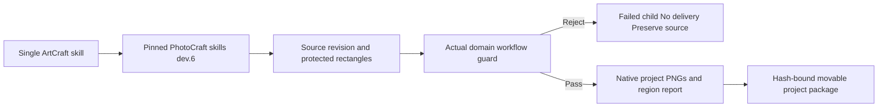

# ArtCraft PhotoCraft Protection Handoff Architecture

Status: candidate skills dev.26 pass independent online integration; fixed plugin and installed-host proof remain pending. Runtime stays at dev.28; the pinned PhotoCraft skill dependency advances from dev.5 to dev.6. Specification: AC-DM-005-PHOTO; task 6.24 remains open.

ArtCraft forwards protectedRegions in the domain plan to the immutable PhotoCraft workflow. It does not assume an unknown dependency supports the guard. A real RED demonstrated that the old dependency returned review_ready for a protected change. The new dependency fails that child without publishing a delivery. The current worker discards domain stdout/stderr, so the parent reports generic native failure, not a captured domain-specific reason.

Valid revisions use a new workflow revision and preserve previous native files and their hashes. The domain manifest binds the report and both comparison PNGs, which travel with child and portable project packages. Moved-package verification checks these files. This is technical evidence, not visual, creative or human acceptance.

The isolated online single-skill test installs only PhotoCraft, creates a real layered source, rejects a protected title change, permits a title revision with unchanged background samples, and packages/moves/verifies the result. It uses no global Node, Pillow or sibling skill path. Source-project Brief inspection remains a separate gap; this revision uses the existing no-Brief path.
