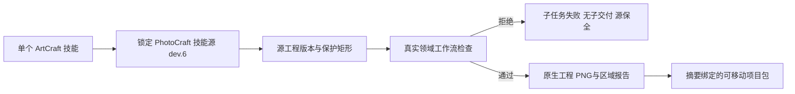

# ArtCraft PhotoCraft 保护交接架构

状态：源候选技能 dev.26 的独立在线联调通过；固定插件和宿主验收待完成。沿用运行时 dev.28，领域依赖从 PhotoCraft 技能 dev.5 更新到固定 dev.6。规范：AC-DM-005-PHOTO；任务 6.24 尚未完成。

ArtCraft 将 protectedRegions 留在领域 plan 中，交给固定 PhotoCraft 工作流实施；不自行把未知支持当作可用。旧依赖的真实失败测试显示保护改动被当作 review_ready；新依赖让该子任务失败且不产生交付。当前 worker 丢弃领域 stdout/stderr，因此上层只报告通用原生失败，不能宣称采集了具体领域原因。

合法修订使用新计划 revision，保留已有原生交付与原始文件摘要。报告和两张对照 PNG 由领域 manifest 绑定，随子工程和便携项目包一起保存；移动后验包核对这些文件。本检查属于技术验证，不代替视觉、创作或人工接受。

独立单技能在线测试只安装 PhotoCraft，创建实际分层源工程，拒绝保护标题改动，执行允许的标题修订，保存背景样本零差异，打包并移动验包。未使用全局 Node、Pillow 或兄弟技能路径。源工程 Brief 元数据检查仍为独立未完成项，此修订使用已有无 Brief 入口。
