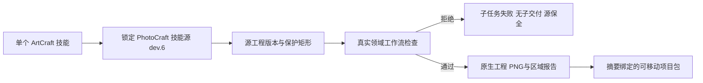

# ArtCraft PhotoCraft 保护交接架构

状态：固定技能 dev.26 和插件 dev.30 的独立在线及实际安装联调通过。沿用运行时 dev.28，领域依赖从 PhotoCraft 技能 dev.5 更新到固定 dev.6。规范：AC-DM-005-PHOTO；任务 6.24 已验证。

ArtCraft 将 protectedRegions 留在领域 plan 中，交给固定 PhotoCraft 工作流实施；不自行把未知支持当作可用。旧依赖的真实失败测试显示保护改动被当作 review_ready；新依赖让该子任务失败且不产生交付。当前 worker 丢弃领域 stdout/stderr，因此上层只报告通用原生失败，不能宣称采集了具体领域原因。

合法修订使用新计划 revision，保留已有原生交付与原始文件摘要。报告和两张对照 PNG 由领域 manifest 绑定，随子工程和便携项目包一起保存；移动后验包核对这些文件。本检查属于技术验证，不代替视觉、创作或人工接受。

独立单技能在线测试只安装 PhotoCraft，创建实际分层源工程，拒绝保护标题改动，执行允许的标题修订，保存背景样本零差异，打包并移动验包。未使用全局 Node、Pillow 或兄弟技能路径。源工程 Brief 元数据检查仍为独立未完成项，此修订使用已有无 Brief 入口。

实际安装 PhotoCraft 保护测试 1 项通过（11.073 秒），ArtCraft 固定依赖交接 1 项通过（22.114 秒），系统 Python 3.14.3；五插件 58 个技能发现通过、加载错误 0，执行后全部摘要不变。证据：codex-release30-protected-native-20261006.json。完整目标与创作接受仍未完成。

修图扩展：固定 PhotoCraft 技能源依赖为 dev.7。公开像素图层创建和笔触操作，以及带保护区域的源工程修订，沿用同一原生工作者和可移动项目包路径。源码候选与实际安装后验证分别记录；固定宿主证据完成前，6.25 保持未勾选。

固定发布及安装后修图复验现已通过；参见 evidence/codex-release31-retouch-native-20261006.json。仅完成有界任务 6.25，不提升完整领域／创作验收状态。
