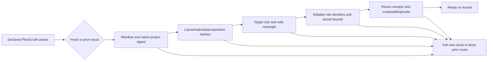

# ArtCraft PhotoCraft variant reuse gate

A legacy skill could ignore a variant declaration yet leave a technically ready native result. The cache regression reproduced review_ready where blocked was required. Runtime dev.41 adds verifyPhotoVariantOutput at fresh adapter verification, existing-ready preflight, cache reuse and dependency handoff, including plans without a Project Brief.

The guard requires a source revision bound to the child manifest, consistent target dimensions and safe rectangle, visible distinct background/product/text roles, a native Type text layer, and saved bounds inside the declared safe area for text/product. It compares native resize receipts, each pre-operation inspection, chained sizes and computed geometry with the hashed layout record. Alias-based role IDs resolve from retained bindings; keep source role aliases stable or use verified numeric source IDs. Missing/stale/contradictory evidence is rejected; the guard does not execute native edits to repair a cache.

Verification includes a legacy-cache scheduler fixture, fresh delivery without Brief, nine file/geometry gate cases, and a real four-domain native flow. That flow verifies a new poster variant, reuse, stale-sidecar refusal, restoration without native replay and source-file preservation. These tests do not establish creative quality, model dispatch or GUI acceptance. Fixed publication/installed first-use evidence is recorded separately before task 6.30 is completed.
