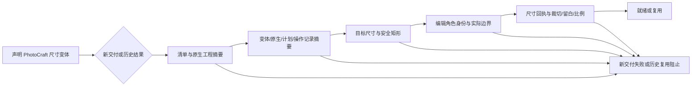

# ArtCraft PhotoCraft 尺寸变体复用门禁

旧技能可能忽略 variant 声明，仍留下技术就绪的原生结果。缓存回归已复现应阻止时却返回 review_ready 的行为。运行时 dev.41 在新适配器交付核验、已有就绪预检、缓存复用和依赖交接加入 verifyPhotoVariantOutput；没有 Project Brief 的计划也必须通过。

门禁要求子清单绑定源修订，目标尺寸和安全矩形一致；背景、产品、文字角色可见且身份互异，文字仍为原生 Type 图层，文字与产品实际边界完整位于安全区。逐项比较原生尺寸回执、操作前检查、尺寸链及几何计算与摘要绑定的变体记录。别名角色从保留的绑定解析，应保持源角色别名稳定或使用已核验的源数字 ID。缺失、陈旧或矛盾证据均拒绝，不执行原生编辑来自动修补缓存。

验证包含历史缓存调度夹具、没有 Brief 的新交付、9 项文件/几何门禁用例以及真实四域原生流程。原生流程覆盖新海报变体、复用、侧车记录陈旧拒绝、恢复记录后不重放编辑及源文件保全。这些测试不证明创作质量、模型派发或 GUI 验收。任务 6.30 完成前另行记录固定发布与安装后首次使用证据。

Fixed proof / 固定验收：plugin dev.42, source dev.32, runtime dev.41. Installed cold workflow 3/3 passed (111.721 s); all 58 isolated skill CLI checks passed (65.342 s); native with/without Brief, stale cache refusal and restoration 1/1 passed (16.081 s). All installed skill files remained unchanged. See `docs/evidence/codex-release42-variant-gate-first-use-20261006.json`. This closes only task 6.30 technical scope; full creative/model/GUI acceptance remains open.
