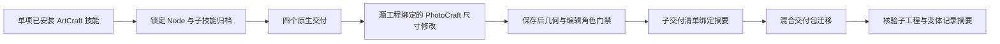

# ArtCraft PhotoCraft 尺寸变体集成

独立 ArtCraft 技能源锁定 PhotoCraft skills dev.8，保留 ArtCraft runtime dev.36。本次不修改可执行运行时逻辑，由已有公开子工具适配器调用新版独立工作流。所有归档字节与逐文件摘要均从不可变源标签生成。

混合功能样例将海报中导入的 Logo 像素图层用作产品/前景角色，不构成真实产品宣传项目的创作验收。PhotoCraft 原生工作流记录画布位移并检查实际保存的尺寸和角色；ArtCraft 将清单绑定的完整记录随子工程复制到混合包。迁移后篡改该记录必须使验证失败。

独立技能在线首次使用 3 项通过（99.697 秒），默认回归 66 项通过、13 项可选跳过；旧 PhotoCraft dev.7 已复现记录缺失失败，五个锁定包重建摘要一致。固定插件 dev.40／技能源 dev.31 的在线冷安装混合复验 3 项通过（104.637 秒），Logo 选择性返工 2 项通过（53.974 秒）。58 项安装技能逐个独立复制后的版本/命令发现检查全部通过（48.163 秒；每域一个全新运行时），安装文件摘要全部保持不变。模型派发、GUI、品牌与审美、完整跨平台行为和全部交换格式保真均不在此次证据范围内。
